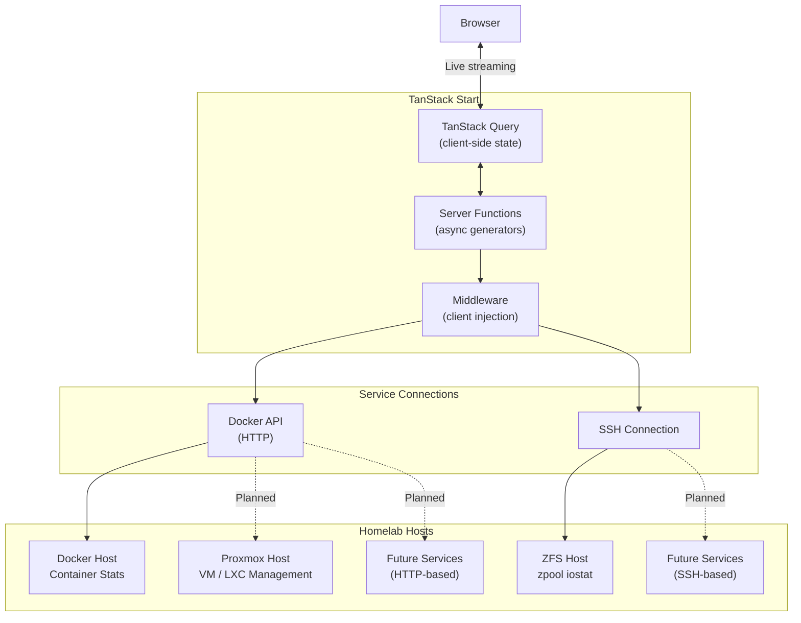
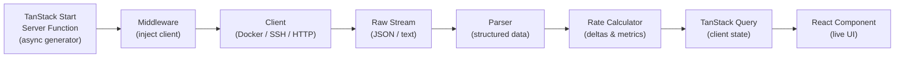

# Homelab Manager

> A real-time monitoring dashboard for homelab infrastructure, built on TanStack Start.

> [!WARNING]
> This project is a **work in progress**. Features are incomplete, APIs may change, and the codebase is under active development. There is no Docker container available yet — see [Roadmap](#roadmap) for what's planned.

## Overview

Homelab Manager aims to be a **one-stop-shop dashboard** for managing Docker hosts, Proxmox clusters, and any other homelab service — all from a single interface. The architecture is designed to be extensible: new data sources can be added through SSH or HTTP connections using a consistent streaming pipeline.

### Current Features

- **Docker Dashboard** — Real-time streaming metrics for all running containers including CPU utilization, memory usage, block I/O (read/write), and network I/O (RX/TX)
- **ZFS Dashboard** — Hierarchical view of ZFS pools, vdevs (mirror/raidz), and disks with capacity, IOPS, and bandwidth metrics streamed over SSH
- **Live-Updating UI** — Server-side async generators stream data continuously to the client with no polling

## Built With

This project is built on the **TanStack ecosystem** as its core framework:

| Layer | Technology | Role |
|-------|-----------|------|
| **Framework** | [TanStack Start](https://tanstack.com/start) | Full-stack React framework — server functions, SSR, and file-based routing |
| **Routing** | [TanStack Router](https://tanstack.com/router) | Type-safe, file-based routing with built-in devtools |
| **Async State** | [TanStack Query](https://tanstack.com/query) | Server state management — caching, refetching, and streaming data consumption |
| **Runtime** | [Bun](https://bun.sh) | Package manager, test runner, and JavaScript runtime |
| **Build** | [Vite](https://vite.dev) | Dev server and production bundler |
| **UI** | [MUI Joy UI](https://mui.com/joy-ui/getting-started/) + [TailwindCSS](https://tailwindcss.com) | Component library and utility-first styling |
| **Docker** | [Dockerode](https://github.com/apocas/dockerode) | Docker Engine API client |
| **SSH** | [ssh2](https://github.com/mscdex/ssh2) | SSH client for remote command execution |
| **Validation** | [Zod](https://zod.dev) | Schema validation |
| **Language** | TypeScript + React 19 | Type-safe UI development |

## Architecture

### System Overview



### Data Streaming Pipeline

Every data source follows the same extensible pipeline pattern. This is what makes it straightforward to add new services — implement a client, parser, and rate calculator, and the rest of the infrastructure handles streaming to the UI.



**How it works:**

1. A **TanStack Start server function** (async generator) is called from the client
2. **Middleware** injects the appropriate connection client (Docker, SSH, etc.)
3. The **client** opens a persistent connection and begins streaming raw data
4. A **parser** transforms the raw stream into structured TypeScript objects
5. A **rate calculator** computes deltas and per-second metrics
6. **TanStack Query** on the client consumes the stream and manages state
7. **React components** re-render with each new data point

## Getting Started

### Prerequisites

- [Bun](https://bun.sh) (package manager and runtime)
- A Docker host with the Docker API exposed (default port `2375`)
- *(Optional)* A host running ZFS with SSH access for pool monitoring

### Environment Setup

A `.env` file is **required** in the project root. Create one based on the variables below:

```env
# Docker Configuration
DOCKER_HOST_1="192.168.1.100"        # Docker host IP or hostname
DOCKER_HOST_PORT_1="2375"            # Docker API port

# ZFS SSH Configuration
ZFS_SSH_HOST="192.168.1.101"         # ZFS host IP or hostname
ZFS_SSH_PORT="22"                    # SSH port
ZFS_SSH_USER="root"                  # SSH username

# Authentication — use ONE of the following:
ZFS_SSH_PASSWORD="your-password"     # Password-based auth

# OR use key-based auth (recommended):
# ZFS_SSH_KEY_PATH="/path/to/private/key"
# ZFS_SSH_KEY_PASSPHRASE="optional-passphrase"
```

### Run Locally

```bash
# Install dependencies
bun install

# Start the dev server (port 3000)
bun dev
```

There is **no Docker container available yet**. Running locally with `bun dev` is currently the only way to use the project. See the roadmap below for self-hosting plans.

## Roadmap

- [ ] **Proxmox API integration** — VM and LXC container management and statistics
- [ ] **Self-hostable Docker Compose** — single `docker compose up` deployment
- [ ] **Authentication** — user login and access control using OIDC with first class Pocket ID support
- [ ] **Optional database support** — persist historical metrics for trend analysis and graphing alongside live statistics
- [ ] **Extensible service architecture** — plugin-like system for adding any service over SSH or HTTP

## AI Disclosure

AI tools are used during development, particularly in early-stage prototyping and testing. **All code is fully human-reviewed** before being merged. The codebase is under active refactoring to ensure it is readable, well-structured, and efficient.

## License

This project is licensed under the [Apache License 2.0](LICENSE).
