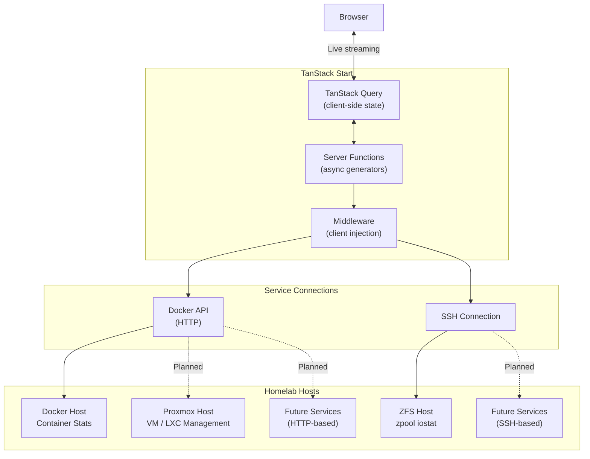
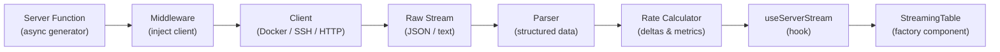

# Homelab Manager

[](https://github.com/jaredglaser/homelab-manager/actions/workflows/ci.yml)

> A real-time monitoring dashboard for homelab infrastructure, built on TanStack Start.

> [!WARNING]
> This project is a **work in progress**. Features are incomplete, APIs may change, and the codebase is under active development. There is no Docker container available yet — see [Roadmap](#roadmap) for what's planned.

## Overview

Homelab Manager aims to be a **one-stop-shop dashboard** for managing Docker hosts, Proxmox clusters, and any other homelab service — all from a single interface. The architecture is designed to be extensible: new data sources can be added through SSH or HTTP connections using a consistent streaming pipeline.

### Current Features

- **Docker Dashboard** (`/`) — Real-time streaming metrics for all running containers including CPU utilization, memory usage, block I/O (read/write), and network I/O (RX/TX)
- **ZFS Dashboard** (`/zfs`) — Hierarchical view of ZFS pools, vdevs (mirror/raidz), and disks with capacity, IOPS, and bandwidth metrics streamed over SSH
- **Live-Updating UI** — Server-side async generators stream data continuously to the client with no polling
- **Factory-Based Table Architecture** — Adding a new streaming data source requires only a server function, column definitions, and a row renderer

## Built With

This project is built on the **TanStack ecosystem** as its core framework:

| Layer | Technology | Role |
|-------|-----------|------|
| **Framework** | [TanStack Start](https://tanstack.com/start) | Full-stack React framework — server functions, SSR, and file-based routing |
| **Routing** | [TanStack Router](https://tanstack.com/router) | Type-safe, file-based routing with built-in devtools |
| **Async State** | [TanStack Query](https://tanstack.com/query) | Server state management — caching, refetching, and streaming data consumption |
| **Runtime** | [Bun](https://bun.sh) | Package manager, test runner, and JavaScript runtime |
| **Build** | [Vite](https://vite.dev) | Dev server and production bundler |
| **UI** | [MUI Joy UI](https://mui.com/joy-ui/getting-started/) + [TailwindCSS](https://tailwindcss.com) | Component library and utility-first styling |
| **Docker** | [Dockerode](https://github.com/apocas/dockerode) | Docker Engine API client |
| **SSH** | [ssh2](https://github.com/mscdex/ssh2) | SSH client for remote command execution |
| **Validation** | [Zod](https://zod.dev) | Schema validation |
| **Language** | TypeScript + React 19 | Type-safe UI development |

## Architecture

### System Overview



### Data Streaming Pipeline

Every data source follows the same extensible pipeline pattern. Adding a new service means implementing a client, parser, and rate calculator on the server — the client-side infrastructure (`useServerStream` hook and `StreamingTable` factory component) handles the rest.



**How it works:**

1. A **TanStack Start server function** (async generator) is called from the client
2. **Middleware** injects the appropriate connection client (Docker, SSH, etc.)
3. The **client** opens a persistent connection and begins streaming raw data
4. A **parser** transforms the raw stream into structured TypeScript objects
5. A **rate calculator** (class implementing `RateCalculator` interface) computes deltas and per-second metrics
6. The **`useServerStream` hook** on the client consumes the async generator, managing abort/cleanup, error state, and optional retry with exponential backoff
7. The **`StreamingTable` factory component** renders the title, loading/error states, column headers, and rows from a declarative config — each data source just provides a stream function, columns, an `onData` reducer, and a row renderer

## Getting Started

### Prerequisites

- [Bun](https://bun.sh) (package manager and runtime)
- A Docker host with the Docker API exposed (default port `2375`)
- *(Optional)* A host running ZFS with SSH access for pool monitoring

### Environment Setup

A `.env` file is **required** in the project root. Create one based on the variables below:

```env
# Docker Configuration
DOCKER_HOST_1="192.168.1.100"        # Docker host IP or hostname
DOCKER_HOST_PORT_1="2375"            # Docker API port

# ZFS SSH Configuration
ZFS_SSH_HOST="192.168.1.101"         # ZFS host IP or hostname
ZFS_SSH_PORT="22"                    # SSH port
ZFS_SSH_USER="root"                  # SSH username

# Authentication — use ONE of the following:
ZFS_SSH_PASSWORD="your-password"     # Password-based auth

# OR use key-based auth (recommended):
# ZFS_SSH_KEY_PATH="/path/to/private/key"
# ZFS_SSH_KEY_PASSPHRASE="optional-passphrase"
```

### Run Locally

```bash
# Install dependencies
bun install

# Start the dev server (port 3000)
bun dev
```

There is **no Docker container available yet**. Running locally with `bun dev` is currently the only way to use the project. See the roadmap below for self-hosting plans.

### Testing

Tests are written using [Bun's built-in test runner](https://bun.sh/docs/cli/test) and are organized in `__tests__/` folders alongside the source code they test:

```bash
# Run all tests (automatically enforces 90% coverage threshold)
bun test

# Run tests in watch mode (no coverage enforcement)
bun test --watch

# Run tests with coverage report only (no enforcement)
bun run test:coverage
```

**Coverage Requirements:**
- Minimum **90% line coverage**
- Minimum **90% function coverage**
- Coverage is **automatically enforced** when running `bun test`
- Coverage is enforced in CI pipeline

Test files follow the `*.test.ts` naming convention and are located in `__tests__/` directories within the same folder as the code they're testing (e.g., `src/lib/__tests__/stream-utils.test.ts` tests `src/lib/stream-utils.ts`).

## Project Structure

```
src/
├── components/
│   ├── AppShell.tsx                 # Shared layout (ThemeProvider, QueryClient, Header)
│   ├── Header.tsx                   # Navigation header
│   ├── ModeToggle.tsx               # Dark/light theme toggle
│   ├── ThemeProvider.tsx            # MUI Joy theme wrapper
│   ├── docker/
│   │   ├── ContainerTable.tsx       # Docker StreamingTable config
│   │   └── ContainerRow.tsx         # Docker container row renderer
│   ├── zfs/
│   │   ├── ZFSPoolsTable.tsx        # ZFS StreamingTable config
│   │   ├── ZFSPoolAccordion.tsx     # Expandable pool row
│   │   ├── ZFSVdevAccordion.tsx     # Expandable vdev row
│   │   ├── ZFSDiskRow.tsx           # Disk row renderer
│   │   └── ZFSMetricCells.tsx       # Shared ZFS metric columns
│   └── shared-table/
│       ├── MetricCell.tsx           # Right-aligned table cell
│       └── StreamingTable.tsx       # Factory component for streaming tables
├── hooks/
│   └── useServerStream.ts          # Generic streaming server function consumer
├── data/
│   ├── docker.functions.tsx         # Docker server functions
│   └── zfs.functions.tsx            # ZFS server functions
├── middleware/
│   ├── docker-middleware.ts         # Docker client injection
│   └── ssh-middleware.ts            # SSH client injection
├── lib/
│   ├── __tests__/                   # Unit tests
│   │   ├── rate-calculator.test.ts
│   │   └── stream-utils.test.ts
│   ├── clients/                     # Connection managers (Docker, SSH)
│   ├── parsers/                     # Stream parsers (ZFS iostat, text lines)
│   ├── test/                        # Test utilities and helpers
│   ├── utils/                       # Rate calculators, hierarchy builders
│   ├── streaming/types.ts           # Core interfaces (StreamingClient, RateCalculator)
│   ├── rate-calculator.ts           # DockerRateCalculator class
│   └── stream-utils.ts             # Async iterator utilities
├── types/                           # Domain types (Docker, ZFS)
├── formatters/metrics.ts            # Number formatting (%, bytes, bits)
├── routes/
│   ├── __root.tsx                   # HTML shell (SSR-safe, no MUI)
│   ├── index.tsx                    # Docker page (/)
│   └── zfs.tsx                      # ZFS page (/zfs)
└── theme.ts                         # MUI Joy theme config
```

## Roadmap

- [ ] **Proxmox API integration** — VM and LXC container management and statistics
- [ ] **Self-hostable Docker Compose** — single `docker compose up` deployment
- [ ] **Authentication** — user login and access control using OIDC with first class Pocket ID support
- [ ] **Optional database support** — persist historical metrics for trend analysis and graphing alongside live statistics
- [ ] **Extensible service architecture** — plugin-like system for adding any service over SSH or HTTP

## Contributing

All changes to `main` must go through a pull request. Direct pushes to `main` are not allowed.

**PR requirements:**
- CI must pass (build, tests, coverage, license check)
- Automatic Claude code review is triggered on every PR
- Human review and approval before merging

**Interacting with Claude on PRs:**
- Mention `@claude` in any PR comment or review to ask questions, request changes, or get implementation help

## AI Disclosure

AI tools are used during development, particularly in early-stage prototyping and testing. **All code is reviewed** before being merged, both by Claude (automated) and by humans. The codebase is under active refactoring to ensure it is readable, well-structured, and efficient.

## License

This project is licensed under the [Apache License 2.0](LICENSE).

All dependencies use permissive licenses compatible with Apache 2.0. License compliance is verified automatically in CI using [license-checker-rseidelsohn](https://github.com/RSeidelsohn/license-checker-rseidelsohn).
