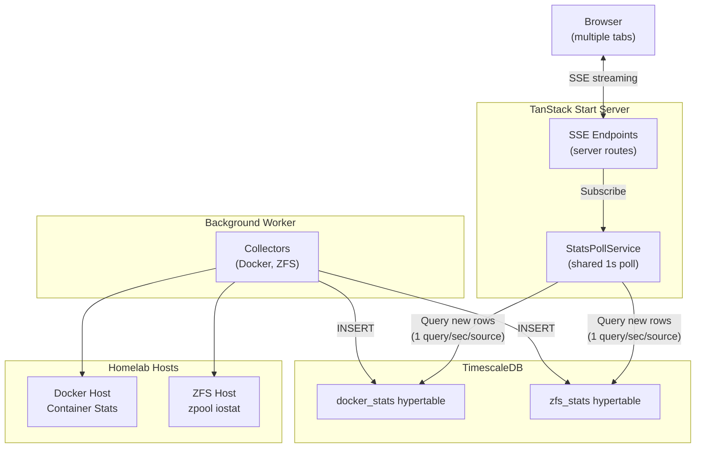
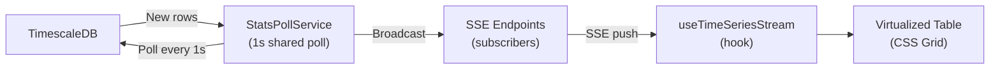

# Homelab Manager

[](https://github.com/jaredglaser/homelab-manager/actions/workflows/ci.yml)

> A real-time monitoring dashboard for homelab infrastructure, built on TanStack Start.

> [!WARNING]
> This project is a **work in progress**. Features are incomplete, APIs may change, and the codebase is under active development. See [Roadmap](#roadmap) for planned features.

## Overview

Homelab Manager aims to be a **one-stop-shop dashboard** for managing Docker hosts, Proxmox clusters, and any other homelab service — all from a single interface. The architecture is designed to be extensible: new data sources can be added through SSH or HTTP connections using a consistent streaming pipeline.

### Current Features

- **Docker Dashboard** (`/`) — Real-time streaming metrics for all running containers including CPU utilization, memory usage, block I/O (read/write), and network I/O (RX/TX) with inline sparkline charts
- **Container Icons** — Auto-resolved icons from Docker image names with manual override via an icon picker (powered by [homarr-labs/dashboard-icons](https://github.com/homarr-labs/dashboard-icons))
- **ZFS Dashboard** (`/zfs`) — Hierarchical view of ZFS pools, vdevs (mirror/raidz), and disks with capacity, IOPS, and bandwidth metrics collected via SSH and streamed from the database
- **TimescaleDB Persistence** — Background worker continuously collects stats every 1 second into wide hypertables with automatic compression (after 1 hour) and retention (7 days)
- **Docker Compose Deployment** — Full stack with TimescaleDB, web server, and background worker (builds from source, no pre-built image)
- **Live-Updating UI** — Server-Sent Events (SSE) stream data continuously to the client; a shared poll service ensures only 1 DB query/sec per source regardless of how many browser tabs are open
- **Virtualized Tables** — CSS Grid layouts with page-scroll virtualization (`useWindowVirtualizer`) for efficient rendering of large container/pool lists
- **Per-Entity Stale Detection** — When a host or container stops reporting, rows stay visible with amber highlighting and a connection warning icon instead of disappearing

## Built With

This project is built on the **TanStack ecosystem** as its core framework:

| Layer | Technology | Role |
|-------|-----------|------|
| **Framework** | [TanStack Start](https://tanstack.com/start) | Full-stack React framework — server functions, SSR, and file-based routing |
| **Routing** | [TanStack Router](https://tanstack.com/router) | Type-safe, file-based routing with built-in devtools |
| **Async State** | [TanStack Query](https://tanstack.com/query) | Server state management — caching, refetching, and stale data detection |
| **Virtualization** | [TanStack Virtual](https://tanstack.com/virtual) | Virtualized rendering for large lists (page-scroll mode) |
| **Runtime** | [Bun](https://bun.sh) | Package manager, test runner, and JavaScript runtime |
| **Build** | [Vite](https://vite.dev) | Dev server and production bundler |
| **UI** | [MUI Joy UI](https://mui.com/joy-ui/getting-started/) + [TailwindCSS](https://tailwindcss.com) | Component library and utility-first styling |
| **Docker** | [Dockerode](https://github.com/apocas/dockerode) | Docker Engine API client |
| **SSH** | [ssh2](https://github.com/mscdex/ssh2) | SSH client for remote command execution |
| **Database** | [TimescaleDB](https://www.timescale.com/) | PostgreSQL with automatic compression and retention for time-series data |
| **Validation** | [Zod](https://zod.dev) | Schema validation |
| **Language** | TypeScript + React 19 | Type-safe UI development |

## Architecture

### System Overview



The frontend reads stats from the database, not directly from Docker/ZFS APIs. This enables:
- **Shared polling** — `StatsPollService` runs 1 query/sec per source, broadcasting results to all SSE clients
- **Direct DB queries** with seq-based cursors — no intermediate cache layer
- **Stale data detection** at both global (30+ second warning) and per-entity levels (amber highlighting for individual hosts/containers)

### Data Streaming Pipeline

The application uses a two-stage pipeline: background collection and real-time streaming.

**Stage 1: Background Collection (Worker)**


**Stage 2: Real-Time Streaming (Server → Browser)**



**How it works:**

1. **Background worker** continuously collects stats from Docker/ZFS APIs every 1 second
2. **Docker collector** keeps stats streams open continuously, flushing every second and only reconnecting on container changes or errors
3. **ZFS collector** streams `zpool iostat` continuously, flushing on each cycle boundary
4. Stats are **inserted** into TimescaleDB wide hypertables
5. **StatsPollService** runs one `setInterval(1s)` per source (docker, zfs), querying for new rows using seq-based cursors and broadcasting results to all subscribed SSE endpoints
6. **SSE endpoints** subscribe to the poll service; multiple browser tabs share the same poll — only 1 DB query/sec per source
7. The **`useTimeSeriesStream` hook** preloads 60s of history via REST, then merges SSE updates into a time-windowed buffer with stale detection
8. **Virtualized tables** render with CSS Grid + `useWindowVirtualizer` for efficient page-scroll rendering, with per-entity stale indicators

## Getting Started

### Prerequisites

- [Bun](https://bun.sh) (package manager and runtime)
- A Docker host with the Docker API exposed (default port `2375`)
- *(Optional)* A host running ZFS with SSH access for pool monitoring

### Environment Setup

A `.env` file is **required** in the project root. Create one based on `.env.example`:

```env
# Docker Configuration
DOCKER_HOST_1="192.168.1.100"        # Docker host IP or hostname
DOCKER_HOST_PORT_1="2375"            # Docker API port

# ZFS Configuration (supports multiple hosts)
ZFS_HOST_1="192.168.1.101"          # ZFS host IP or hostname
ZFS_HOST_PORT_1="22"                # SSH port
ZFS_HOST_USER_1="root"              # SSH username

# Authentication — use ONE of the following:
ZFS_HOST_PASSWORD_1="your-password" # Password-based auth

# OR use key-based auth (recommended):
# ZFS_HOST_KEY_PATH_1="/path/to/private/key"
# ZFS_HOST_KEY_PASSPHRASE_1="optional-passphrase"
```

### Run Locally

#### Option 1: Docker Compose (Recommended)

```bash
# Start the full stack (TimescaleDB, web server, background worker)
docker compose up -d

# View logs
docker compose logs -f

# Stop everything
docker compose down
```

Access the UI at http://localhost:3000

#### Option 2: Local Development

**With Docker Compose (recommended)** — includes TimescaleDB, worker, and hot reload:

```bash
bun install             # Install dependencies
bun dev:docker:up       # Start TimescaleDB + worker with HMR
bun dev:docker:down     # Stop dev services
bun dev:docker:restart  # Restart dev services
```

**Without Docker Compose** — requires external TimescaleDB:

```bash
bun install             # Install dependencies
bun dev                 # Start dev server (port 3000)
bun worker              # Start background worker (separate terminal)
```

### Testing

Tests are written using [Bun's built-in test runner](https://bun.sh/docs/cli/test) and are organized in `__tests__/` folders alongside the source code they test:

```bash
# Run all tests (automatically enforces 93% coverage threshold)
bun test

# Run tests in watch mode (no coverage enforcement)
bun test --watch

# Run tests with coverage report only (no enforcement)
bun run test:coverage
```

**Coverage Requirements:**
- Minimum **93% line coverage**
- Minimum **93% function coverage**
- Coverage is **automatically enforced** when running `bun test`
- Coverage is enforced in CI pipeline

Test files follow the `*.test.ts` naming convention and are located in `__tests__/` directories within the same folder as the code they're testing (e.g., `src/lib/__tests__/stream-utils.test.ts` tests `src/lib/stream-utils.ts`).

## Project Structure

```
src/
├── components/
│   ├── AppShell.tsx                 # Shared layout (ThemeProvider, QueryClient, Header)
│   ├── Header.tsx                   # Navigation header
│   ├── PageHeader.tsx               # Page title with optional actions
│   ├── ModeToggle.tsx               # Dark/light theme toggle
│   ├── ThemeProvider.tsx            # MUI Joy theme wrapper
│   ├── docker/
│   │   ├── ContainerTable.tsx       # Docker table (CSS Grid + useWindowVirtualizer, includes HostRow)
│   │   ├── ContainerRow.tsx         # Container row with icon, metrics, and sparklines
│   │   ├── ContainerChartsCard.tsx  # Expanded container detail charts (60s history)
│   │   ├── ContainerMetricChart.tsx # Individual metric chart component
│   │   ├── SparklineChart.tsx       # Inline SVG sparkline for real-time metrics
│   │   └── IconPickerDialog.tsx     # Container icon picker with search
│   ├── zfs/
│   │   ├── ZFSPoolsTable.tsx        # ZFS table (CSS Grid + useWindowVirtualizer)
│   │   ├── ZFSPoolSpeedCharts.tsx   # Pool-level speed charts
│   │   └── ZFSPoolSpeedChart.tsx    # Individual pool speed chart
│   └── shared-table/
│       └── MetricValue.tsx          # Formatted metric display (value + unit + optional sparkline)
├── hooks/
│   ├── useSSE.ts                    # EventSource-based SSE consumer
│   ├── useTimeSeriesStream.ts       # Preload + SSE merge + time-windowed buffer + stale detection
│   └── useSettings.tsx              # User preferences (expansion state, display modes, decimals)
├── data/
│   ├── docker.functions.tsx         # Docker server functions (active containers, icon updates)
│   ├── settings.functions.tsx       # Settings server functions (get/update)
│   └── zfs.functions.tsx            # ZFS server functions (active pools, stale check)
├── middleware/
│   ├── docker-middleware.ts         # Docker client injection
│   └── ssh-middleware.ts            # SSH client injection
├── lib/
│   ├── __tests__/                   # Unit tests
│   ├── clients/                     # Connection managers (Docker, SSH, Database)
│   ├── config/                      # Configuration loaders (database, worker)
│   ├── database/
│   │   ├── repositories/            # Data access layer (StatsRepository, SettingsRepository)
│   │   ├── subscription-service.ts  # StatsPollService — shared 1s poll, broadcasts to SSE clients
│   │   └── migrate.ts               # Database migration runner
│   ├── parsers/                     # Stream parsers (ZFS iostat, text lines)
│   ├── test/                        # Test utilities and helpers
│   ├── utils/
│   │   ├── docker-hierarchy-builder.ts  # Wide rows → domain objects + host/container hierarchy
│   │   ├── zfs-hierarchy-builder.ts     # Wide rows → domain objects + pool/vdev/disk hierarchy
│   │   ├── icon-resolver.ts             # Auto-resolve icons from Docker image names
│   │   └── available-icons.ts           # Icon slug registry (dashboard-icons)
│   ├── streaming/types.ts           # Core interfaces (StreamingClient, RateCalculator)
│   └── server-init.ts               # Server-side shutdown handlers
├── worker/
│   ├── collectors/                  # Background collectors (Docker, ZFS)
│   └── collector.ts                 # Worker entry point
├── types/                           # Domain types (Docker, ZFS)
├── formatters/metrics.ts            # Number formatting (%, bytes, bits)
├── routes/
│   ├── __root.tsx                   # HTML shell (SSR-safe, no MUI)
│   ├── api/
│   │   ├── docker-stats.ts          # Docker SSE endpoint
│   │   └── zfs-stats.ts             # ZFS SSE endpoint
│   ├── index.tsx                    # Docker page (/)
│   ├── settings.tsx                 # Settings page (/settings)
│   └── zfs.tsx                      # ZFS page (/zfs)
└── theme.ts                         # MUI Joy theme config

public/icons/                        # SVG icons from homarr-labs/dashboard-icons
migrations/                          # SQL migrations (settings + TimescaleDB wide tables)
```

## Roadmap

- [x] **TimescaleDB persistence** — background worker collects stats into wide hypertables with automatic compression and 7-day retention
- [x] **Docker Compose deployment** — multi-container setup with TimescaleDB, web server, and background worker
- [x] **Database-backed streaming** — frontend reads from TimescaleDB via shared server-side polling instead of direct API/SSH connections; a `StatsPollService` runs 1 query/sec per source and broadcasts to all SSE clients
- [ ] **Return to TanStack Start streaming server functions** — currently using SSE as a workaround because streaming server functions don't close quickly enough when rapidly switching between tabs; once TanStack Start's abort signal propagation is more reliable, migrate back to the native streaming pattern
- [ ] **Historical data UI** — charts and graphs for historical metrics with time-range selection
- [ ] **Proxmox API integration** — VM and LXC container management and statistics
- [ ] **Authentication** — user login and access control using OIDC with first class Pocket ID support
- [ ] **Pre-built Docker image** — publish to a container registry for one-step deployment without building from source
- [ ] **Extensible service architecture** — plugin-like system for adding any service over SSH or HTTP

## AI Disclosure

AI tools are used during development, particularly in early-stage prototyping and testing. **All code is fully human-reviewed** before being merged. The codebase is under active refactoring to ensure it is readable, well-structured, and efficient.

## License

This project is licensed under the [Apache License 2.0](LICENSE).

All dependencies use permissive licenses compatible with Apache 2.0. License compliance is verified automatically in CI using [license-checker-rseidelsohn](https://github.com/RSeidelsohn/license-checker-rseidelsohn).
