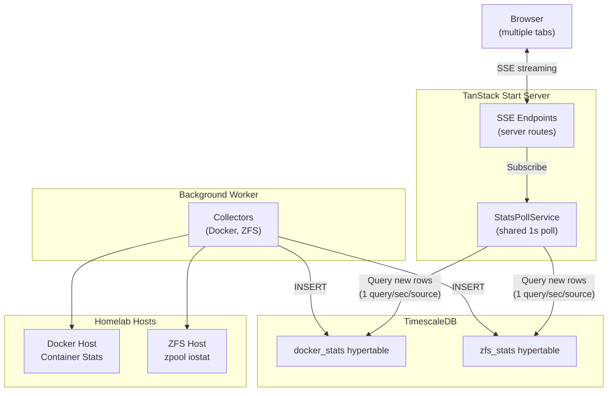
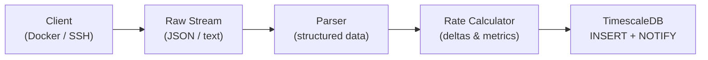
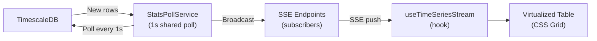

# Architecture

## System Overview

The frontend reads stats from the database, not directly from Docker/ZFS APIs. This enables:
- **Shared polling** — `StatsPollService` runs 1 query/sec per source, broadcasting results to all SSE clients
- **Direct DB queries** with seq-based cursors — no intermediate cache layer
- **Stale data detection** at both global (30+ second warning) and per-entity levels (amber highlighting for individual hosts/containers)

## Data Streaming Pipeline

The application uses a two-stage pipeline: background collection and real-time streaming.

### Stage 1: Background Collection (Worker)

### Stage 2: Real-Time Streaming (Server → Browser)

### How It Works

1. **Background worker** continuously collects stats from Docker/ZFS APIs every 1 second
2. **Docker collector** keeps stats streams open continuously, flushing every second and only reconnecting on container changes or errors
3. **ZFS collector** streams `zpool iostat` continuously, flushing on each cycle boundary
4. Stats are **inserted** into TimescaleDB wide hypertables
5. **StatsPollService** runs one `setInterval(1s)` per source (docker, zfs), querying for new rows using seq-based cursors and broadcasting results to all subscribed SSE endpoints
6. **SSE endpoints** subscribe to the poll service; multiple browser tabs share the same poll — only 1 DB query/sec per source
7. The **`useTimeSeriesStream` hook** preloads 60s of history via REST, then merges SSE updates into a time-windowed buffer with stale detection
8. **Virtualized tables** render with CSS Grid + `useWindowVirtualizer` for efficient page-scroll rendering, with per-entity stale indicators

## Proxmox Integration

Unlike Docker/ZFS (which use background workers + TimescaleDB + SSE), Proxmox uses **server-side shared polling** of the Proxmox REST API with SSE broadcast:

- **No background worker** — `ProxmoxPollService` runs server-side, auto-starts on first SSE subscriber
- **No database persistence** — cluster overview is fetched fresh from the API each poll cycle
- **Shared poll** — one `setInterval(10s)` polls the API regardless of how many clients are connected
- **SSE broadcast** — all connected clients receive the same snapshot via Server-Sent Events
