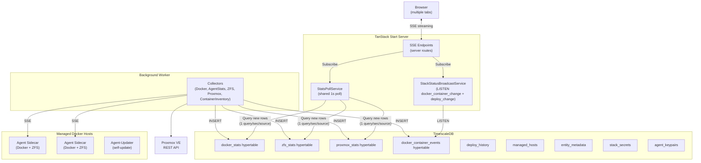
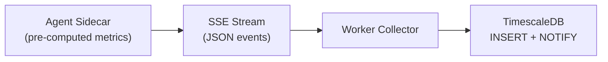
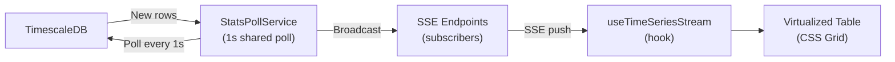
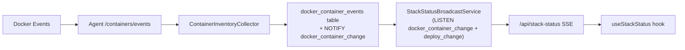
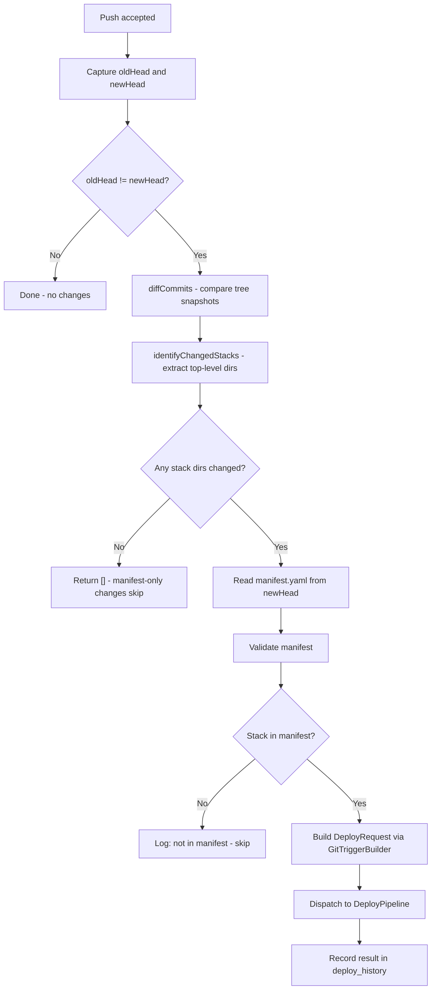

# Architecture

## System Overview



The frontend reads stats from the database, not directly from Docker/ZFS APIs. This enables:
- **Shared polling** - `StatsPollService` runs 1 query/sec per source, broadcasting results to all SSE clients
- **Direct DB queries** with seq-based cursors - no intermediate cache layer
- **Stale data detection** at both global (30+ second warning) and per-entity levels (amber highlighting for individual hosts/containers)

## Data Streaming Pipeline

The application uses a two-stage pipeline: background collection and real-time streaming.

### Stage 1: Background Collection (Worker)



The worker connects to agent sidecars on each managed host via SSE. For Docker stats, the agent pre-computes metrics (CPU%, memory%, network/block I/O rates) before streaming, so the worker receives ready-to-insert rows. For ZFS, the agent streams raw `zpool iostat` output which the worker parses and rate-calculates. Proxmox is a direct REST API poll (no agent).

### Stage 2: Real-Time Streaming (Server -> Browser)



### How It Works

1. **Agent sidecars** run alongside each managed Docker host, streaming stats and container events
2. **AgentStatsCollector** connects to each agent's `/stats/stream` endpoint and receives pre-computed Docker metrics (CPU%, memory, network/block I/O rates)
3. **ZFSCollector** connects to each agent's `/zfs/stats/stream` endpoint, parses `zpool iostat` output, and calculates rates
4. **ContainerInventoryCollector** connects to each agent's `/containers/events` endpoint and persists container inventory events to `docker_container_events`
5. **Proxmox collector** polls the Proxmox REST API at a configurable interval (1s or 10s), converts the cluster overview to flat rows, and inserts into TimescaleDB
6. Stats are **inserted** into TimescaleDB wide hypertables
7. **StatsPollService** runs one `setInterval(1s)` per source (docker, zfs, proxmox), querying for new rows using seq-based cursors and broadcasting results to all subscribed SSE endpoints
8. **SSE endpoints** subscribe to the poll service; multiple browser tabs share the same poll - only 1 DB query/sec per source
9. The **`useTimeSeriesStream` hook** preloads history via REST, then merges SSE updates into a time-windowed buffer with stale detection
10. **Virtualized tables** render via the shared `DataTable` component (CSS Grid + conditional `useVirtualizer`). Tables under 150 rows use `contentVisibility: 'auto'` so the browser natively skips layout/paint for off-screen rows while preserving Collapse animations on nested detail panels (which break under virtualization); larger tables enable contained virtualization. Per-entity stale indicators highlight hosts that stop reporting

## Proxmox Data Model

Proxmox uses a single wide `proxmox_stats` hypertable with an `entity_type` discriminator column to distinguish cluster, node, qemu, lxc, and storage entities (similar to how ZFS uses `entity_type` for pool/vdev/disk). This keeps the architecture consistent: one table -> one StatsPollService source -> one SSE stream -> one `useTimeSeriesStream` hook.

- **Bidirectional conversion**: `overviewToRows()` converts the Proxmox API overview to flat DB rows; `buildProxmoxOverview()` reconstructs the overview from latest rows per entity
- **Runtime-configurable interval**: The Proxmox poll interval (1s or 10s) can be changed via the settings UI; changes propagate via `SettingsListener` -> `ProxmoxCollector.pollInterval` setter
- **Entity ID convention**: nodes use `node` name, guests use `vmid`, storages use `${node}/${storage}` for cross-node uniqueness

## Docker Stack Management

GitOps-style Docker stack management. Users define stacks as docker-compose files in a git repository managed by homelab-manager. Changes (via an in-app editor or `git push`) trigger deployments to Docker hosts through lightweight agent containers.

### High-Level Flow

```
User's IDE --git push--> homelab-manager git server --post-receive--+
                                                                     |
User's Browser --UI edit--> homelab-manager commits ----------------> Deploy Pipeline
                                                                     |
                                         +---------------------------+
                                         |                           |
                                    Agent (host-1)              Agent (host-2)
                                    via socket proxy            via socket proxy
```

### Components

| Component | Location | Description |
|-----------|----------|-------------|
| Agent container | `agent/` | Sidecar for Docker/ZFS operations on managed hosts |
| Agent-updater | `agent-updater/` | Sidecar for automatic agent container updates |
| Deploy pipeline | `src/lib/deploy/` | Trigger-agnostic deploy orchestration |
| Git management | `src/lib/git/` | In-app bare git repo with HTTP smart protocol |
| Crypto helpers | `src/lib/crypto/` | Master key resolution, JWE encrypted-value, Ed25519 agent JWT signing |
| Stack service | `src/lib/stacks/` | Stack CRUD, mapping, and status broadcast |
| Host management | `src/data/hosts/` | Host CRUD handlers with keypair enrollment and JWT signer resolution |
| Stacks UI | `src/components/stacks/` | Full stack management interface |
| Settings UI | `src/components/settings/` | Managed hosts card and add-host wizard |

### Managed Hosts & Agent Architecture

Hosts are registered via the Settings UI and stored in the `managed_hosts` database table with agent connection details and capabilities (docker, zfs).

**Collector creation** (`src/worker/collector-factory.ts`):
- `createCollectors()`: env-configured collectors (Proxmox only; Docker and ZFS always go through managed hosts)
- `resolveAgentUrl()`: rewrites localhost agent URLs to Docker-internal hostnames via `WORKER_LOCALHOST_AGENT` env var

**Managed-host collector lifecycle** (`src/worker/host-collector-manager.ts`):
- `HostCollectorManager`: owns one `AsyncDisposableStack` per registered host, each containing `AgentStatsCollector`, `ContainerInventoryCollector`, and/or `ZFSCollector` depending on the host's capabilities. `reconcile()` is the sole mutator: it adds collectors for new hosts, disposes them for removed hosts, and recreates them when a host's `agentUrl` or capabilities change. Reconcile calls are serialised through an internal promise chain so back-to-back notifications don't race.

**JWT signing**: Per-agent Ed25519 keypairs are stored encrypted in `agent_keypairs`. The deploy pipeline signs a short-lived JWT for each request; the agent verifies it against its trusted public JWK. Hosts with no keypair are skipped with a logged warning.

**URL remapping**: `resolveAgentUrl()` rewrites localhost agent URLs to Docker-internal hostnames via `WORKER_LOCALHOST_AGENT` env var, enabling the worker container to reach agents on the same Docker network.

### Agent Container (`agent/`)

A separate Bun package that runs as a sidecar container alongside each managed Docker host. Zero framework dependencies beyond Dockerode. Capabilities are auto-detected at startup (Docker via `DOCKER_HOST` env var, ZFS via `zpool` binary presence).

**Architecture:**
- Ed25519 JWT authentication (trusted public JWK loaded from `AGENT_TRUSTED_PUBKEY[_FILE]` at startup; per-request JWTs verified against it). JWTs carry `aud` set to the managed host name; the agent verifies it against the required `AGENT_HOST_NAME` so a token minted for another host is rejected
- Optional TLS via `TLS_CERT_PATH` and `TLS_KEY_PATH`
- Connects to Docker via `DOCKER_HOST` env var (socket proxy recommended)
- Subprocess timeout (5 minutes) for `docker compose` operations

**Endpoints:**

| Method | Path | Purpose |
|--------|------|---------|
| GET | `/health` | Liveness heartbeat, status only (unauthenticated) |
| GET | `/info` | Agent version + Docker/ZFS capability detail (authenticated) |
| GET | `/auth/verify` | JWT verification |
| GET | `/stats/stream` | SSE container stats with pre-computed metrics |
| GET | `/logs/:containerId` | SSE container log streaming (backlog + live phases) |
| GET | `/containers/events` | SSE container inventory stream |
| POST | `/stacks/deploy` | Run `docker compose up -d` |
| POST | `/stacks/teardown` | Run `docker compose down` |
| POST | `/stacks/restart` | Run `docker compose restart` |
| GET | `/stacks/status` | List stacks in working directory |
| GET | `/zfs/stats/stream` | SSE `zpool iostat -v 1` output as `{ line, timestamp }` events |
| GET | `/zfs/pools` | Parsed pool status (name, size, allocated, free, capacity, health) |
| POST | `/agent/update` | Self-update: pull new image, recreate container, verify health |

**Socket proxy setup:** Each Docker host needs a Docker socket proxy. We recommend [linuxserver/socket-proxy](https://github.com/linuxserver/docker-socket-proxy) with `CONTAINERS=1`, `IMAGES=1`, `NETWORKS=1`, `VOLUMES=1`, `POST=1` permissions, but any compatible proxy will work.

### Agent-Updater Sidecar (`agent-updater/`)

Separate Bun service that monitors and updates agent containers without manual Docker commands. Connects directly to the Docker socket proxy (bypasses the agent, which cannot replace its own container).

**Update sequence:**
1. Pull new agent image from registry
2. Inspect existing container to capture environment and host config
3. Stop and remove old container
4. Create new container with same config but new image
5. Start new container
6. Verify health with exponential backoff (500ms, 1s, 2s delays)

### Deploy Pipeline (`src/lib/deploy/`)

Trigger-agnostic orchestration layer. Accepts `DeployRequest` objects from either `GitTriggerBuilder` (post-receive) or `UITriggerBuilder` (UI actions).

**Pipeline stages:**

```
DeployRequest -> Validate -> Resolve Secrets -> Dispatch to Agent -> Record Result
```

- **Change detection:** Content hashing to skip no-op deploys
- **Secret resolution:** Pluggable `SecretResolver` interface. Resolves `${SECRET:name}` variable references in compose files; values are stored JWE-encrypted in the `stack_secrets` table
- **Concurrency control:** PostgreSQL partial unique index prevents concurrent deploys to the same stack+host
- **Agent client:** HTTP wrapper for communicating with agents (deploy/teardown/restart)

**Database tables:**
- `managed_hosts`: registered Docker hosts with agent connection details and capabilities
- `deploy_history`: deploy records with status tracking (pending -> in_progress -> succeeded/failed/no_change)
- `docker_container_events`: per-host container inventory events from agent `/containers/events`

### Stack Status Pipeline

Real-time stack container status tracking from agent to browser:



- **Agent** subscribes to Docker daemon events, streams container inventory via SSE
- **ContainerInventoryCollector** (worker) persists events to the `docker_container_events` table
- **StackStatusBroadcastService** (server) listens to PostgreSQL `NOTIFY` on `docker_container_change` and `deploy_change` channels
- **SSE endpoint** sends initial full snapshot on connect, then incremental updates
- **Event types:** `{ type: 'status', entries: [...] }` and `{ type: 'deploy_changed', stack, host }`

### Git Management (`src/lib/git/`)

Server-side git repository using isomorphic-git for repo operations and git CLI for HTTP smart protocol.

**Startup:**

```
Server boots
  -> ensureRepoInitialized()
    -> initBareRepo (create /data/repos/stacks.git if needed)
    -> No commits? Seed manifest.yaml with "stacks: {}"
```

**Git HTTP smart protocol** (`src/routes/api/git.$.ts`):

Exposes a standard git HTTP endpoint at `/api/git/stacks/...` for clone, fetch, and push operations.

```
Clone/Fetch:
  GET  /api/git/stacks/info/refs?service=git-upload-pack
  POST /api/git/stacks/git-upload-pack

Push:
  GET  /api/git/stacks/info/refs?service=git-receive-pack
  POST /api/git/stacks/git-receive-pack
```

- Bearer token authentication
- Repo name validation and path traversal protection
- Request body size limit (50MB)
- Subprocess exit code checking

**Post-receive flow** (after `git push`):



Pipeline errors do not block the git push; they are caught and logged.

**Manifest format** (`manifest.yaml`):

```yaml
stacks:
  plex:
    host: homeserver
    autoDeploy: true
  traefik:
    host: homeserver
    autoDeploy: false
```

**In-app editor operations** (`src/lib/git/editor-operations.ts`):

- `saveAndCommitFile`: save a compose file and create a commit
- `updateManifest`: add/update a stack entry in manifest.yaml

**Concurrency safety:** Commits are serialized per-repo via an async mutex to prevent lost updates from concurrent writes.

**Key modules:**

| Module | Purpose |
|--------|---------|
| `repo.ts` | Bare repo init, commit, read, list, log, diff (isomorphic-git) |
| `git-server.ts` | HTTP smart protocol handlers via `Bun.spawn` |
| `git-http.ts` | Path parsing and request type classification |
| `manifest.ts` | YAML manifest parsing and validation |
| `post-receive.ts` | Change detection and deploy request builder |
| `post-receive-handler.ts` | Post-receive orchestration with pipeline dispatch |
| `init-repo.ts` | Startup initialization with seed manifest |
| `editor-operations.ts` | In-app file save/commit and manifest updates |
| `git-server-functions.ts` | File tree builder for UI |

### Secrets and Keypairs

At-rest encryption uses a symmetric `MASTER_KEY` (base64, 256-bit) resolved at startup from the `MASTER_KEY` env var or `MASTER_KEY_FILE`.

- **Stack secrets** (`stack_secrets` table): name/value pairs stored as JWE-encrypted blobs. The deploy pipeline resolves `${SECRET:name}` references in compose files before dispatching to agents (`src/lib/crypto/encrypted-value.ts`)
- **Agent keypairs** (`agent_keypairs` table): per-host Ed25519 keypairs. The private JWK is stored JWE-encrypted; the public JWK is injected into the agent container as the `AGENT_TRUSTED_PUBKEY` env var when the dashboard provisions the agent (`src/lib/services/agent-provisioning-service.ts`). The dev compose flow writes the JWK to `data/dev-agent-pubkey.json` and the agent loads it via `AGENT_TRUSTED_PUBKEY_FILE`. Each deploy request carries a short-lived JWT signed by the private key (`src/lib/crypto/agent-jwt.ts`)
- `src/lib/crypto/master-key.ts` handles key resolution and exports the AES-GCM key object used by the JWE helpers

### Stacks UI

Full stack management interface at `/stacks` (top-level navigation).

| Component | Purpose |
|-----------|---------|
| `StackActionBar` | Deploy, teardown, restart action buttons |
| `ComposeEditor` | Monaco YAML editor with Compose schema validation |
| `ContainerList` | Running containers for a stack with status |
| `DeployHistoryList` / `DeployHistoryRow` | Deploy history timeline with rollback |
| `VariablesPanel` / `VariableRow` | Stack variables editor (JWE-encrypted in `stack_secrets`) |
| `CreateStackDialog` | Create new stack |
| `DeleteStackDialog` | Stack deletion confirmation |
| `RollbackDialog` | Rollback to previous deployment |
| `StackSettingsDialog` | Stack settings editor |
| `SyncStatusBadge` | Git sync status badge |

**Real-time updates:** The `useStackStatus` hook subscribes to `/api/stack-status` SSE endpoint. Container status changes and deployment completions are broadcast to all connected browsers.

### Host Management (Settings UI)

Managed hosts are configured via the Settings page:

| Component | Purpose |
|-----------|---------|
| `AddHostWizard` | Multi-step wizard for onboarding new hosts with token generation |
| `ManagedHostsCard` | Host list with status, capabilities, and actions |
| `HostDialogs` | Edit and delete confirmation dialogs |
| `HostRow` | Individual host row with health indicator |
