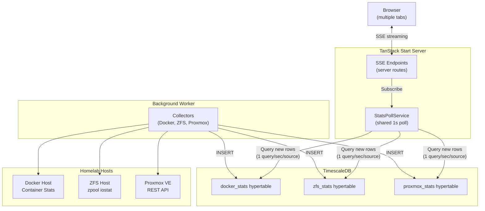
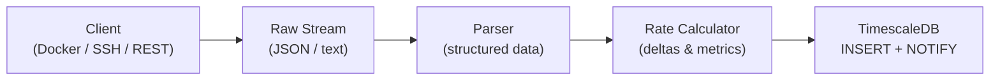
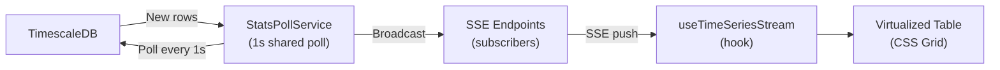
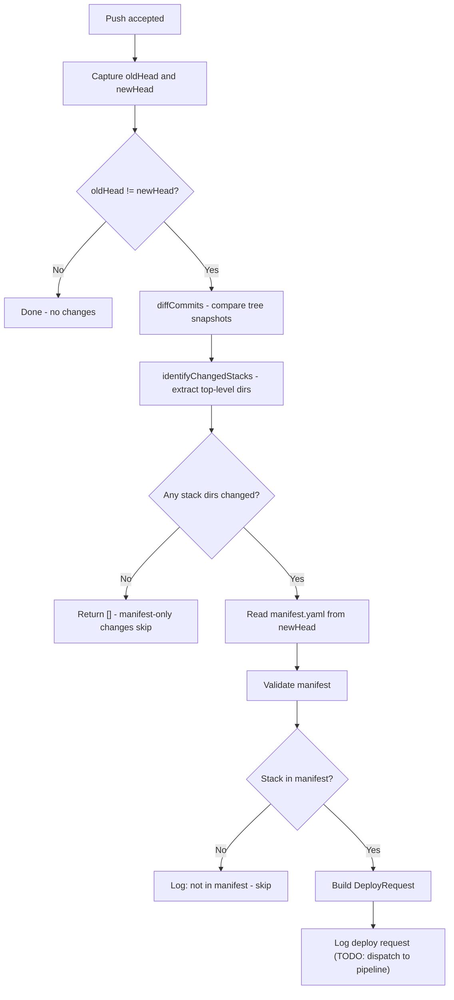

# Architecture

## System Overview



The frontend reads stats from the database, not directly from Docker/ZFS APIs. This enables:
- **Shared polling** - `StatsPollService` runs 1 query/sec per source, broadcasting results to all SSE clients
- **Direct DB queries** with seq-based cursors - no intermediate cache layer
- **Stale data detection** at both global (30+ second warning) and per-entity levels (amber highlighting for individual hosts/containers)

## Data Streaming Pipeline

The application uses a two-stage pipeline: background collection and real-time streaming.

### Stage 1: Background Collection (Worker)



> **Note:** Docker and ZFS follow this full pipeline (streaming → parse → rate-calculate → insert). Proxmox is simpler: it polls the REST API, converts the response to flat rows via `overviewToRows()`, and inserts directly - no streaming parser or rate calculator needed.

### Stage 2: Real-Time Streaming (Server → Browser)



### How It Works

1. **Background worker** continuously collects stats from Docker/ZFS APIs every 1 second and Proxmox API every 10 seconds (configurable)
2. **Docker collector** keeps stats streams open continuously, flushing every second and only reconnecting on container changes or errors
3. **ZFS collector** streams `zpool iostat` continuously, flushing on each cycle boundary
4. **Proxmox collector** polls the Proxmox REST API at a configurable interval (1s or 10s), converts the cluster overview to flat rows with entity type discriminator, and inserts into TimescaleDB
5. Stats are **inserted** into TimescaleDB wide hypertables
6. **StatsPollService** runs one `setInterval(1s)` per source (docker, zfs, proxmox), querying for new rows using seq-based cursors and broadcasting results to all subscribed SSE endpoints
7. **SSE endpoints** subscribe to the poll service; multiple browser tabs share the same poll - only 1 DB query/sec per source
8. The **`useTimeSeriesStream` hook** preloads history via REST, then merges SSE updates into a time-windowed buffer with stale detection
9. **Virtualized tables** render with CSS Grid + `useWindowVirtualizer` for efficient page-scroll rendering, with per-entity stale indicators

## Proxmox Data Model

Proxmox uses a single wide `proxmox_stats` hypertable with an `entity_type` discriminator column to distinguish cluster, node, qemu, lxc, and storage entities (similar to how ZFS uses `entity_type` for pool/vdev/disk). This keeps the architecture consistent: one table → one StatsPollService source → one SSE stream → one `useTimeSeriesStream` hook.

- **Bidirectional conversion**: `overviewToRows()` converts the Proxmox API overview to flat DB rows; `buildProxmoxOverview()` reconstructs the overview from latest rows per entity
- **Runtime-configurable interval**: The Proxmox poll interval (1s or 10s) can be changed via the settings UI; changes propagate via `SettingsListener` → `ProxmoxCollector.pollInterval` setter
- **Entity ID convention**: nodes use `node` name, guests use `vmid`, storages use `${node}/${storage}` for cross-node uniqueness

## Docker Stack Management

> Feature-flagged behind `DOCKER_MANAGEMENT_FEATURE_FLAG=true`. When off, the existing monitoring-only Docker page is unaffected.

GitOps-style Docker stack management. Users define stacks as docker-compose files in a git repository managed by homelab-manager. Changes — via an in-app editor or `git push` — trigger deployments to Docker hosts through lightweight agent containers.

### High-Level Flow

```
User's IDE ──git push──▶ homelab-manager git server ──post-receive──┐
                                                                     ▼
User's Browser ──UI edit──▶ homelab-manager commits ──────────────▶ Deploy Pipeline
                                                                     │
                                         ┌───────────────────────────┤
                                         ▼                           ▼
                                    Agent (host-1)              Agent (host-2)
                                    TLS + Bearer token          TLS + Bearer token
                                    Docker socket mounted       Docker socket mounted
```

### Components

| Component | Location | Status |
|-----------|----------|--------|
| Agent container | `agent/` | Merged (PR #50) |
| Deploy pipeline | `src/lib/deploy/` | Merged (PR #51) |
| Git management | `src/lib/git/` | PR #52 |
| OpenBao secrets | `src/lib/clients/openbao-client.ts` | PR #53 (planned) |
| Host management + UI | `src/lib/services/`, `src/components/stacks/` | PR #54 (planned) |

### Agent Container (`agent/`)

A separate Bun package that runs as a sidecar container alongside each managed Docker host. Zero framework dependencies beyond Dockerode.

**Architecture:**
- Bearer token authentication (TLS planned)
- Connects to Docker via mounted `/var/run/docker.sock` (direct access, no socket proxy)
- Subprocess timeout (5 minutes) for `docker compose` operations

**Endpoints:**

| Method | Path | Purpose |
|--------|------|---------|
| GET | `/health` | Docker version check + heartbeat |
| GET | `/stats/stream` | SSE container stats streaming |
| GET | `/logs/:containerId` | SSE container log streaming |
| POST | `/stacks/deploy` | Run `docker compose up -d` |
| POST | `/stacks/teardown` | Run `docker compose down` |
| POST | `/stacks/restart` | Run `docker compose restart` |
| GET | `/stacks/status` | List stacks in working directory |

**Deployment:** The agent runs on each managed Docker host with the Docker socket mounted directly. It can be deployed automatically via SSH from homelab-manager, or manually by the user running a provided `docker run` one-liner. See [OpenBao Architecture — Agent Deployment Flow](./openbao-architecture.md#agent-deployment-flow) for details.

### Deploy Pipeline (`src/lib/deploy/`)

Trigger-agnostic orchestration layer. Accepts `DeployRequest` objects from either `GitTriggerBuilder` (post-receive) or `UITriggerBuilder` (future UI actions).

**Pipeline stages:**

```
DeployRequest → Validate → Resolve Secrets → Dispatch to Agent → Record Result
```

- **Change detection:** Content hashing to skip no-op deploys
- **Secret resolution:** Pluggable interface — no-op by default, OpenBao when configured
- **Concurrency control:** PostgreSQL partial unique index prevents concurrent deploys to the same stack+host
- **Agent client:** HTTP wrapper for communicating with agents (deploy/teardown/restart)

**Database tables:**
- `managed_hosts` — registered Docker hosts with agent connection details
- `deploy_history` — deploy records with status tracking (pending → running → success/failed)

### Git Management (`src/lib/git/`)

Server-side git repository using isomorphic-git for repo operations and git CLI for HTTP smart protocol.

**Startup:**

```
Server boots
  → DOCKER_MANAGEMENT_FEATURE_FLAG=true?
    → ensureRepoInitialized()
      → initBareRepo (create /data/repos/stacks.git if needed)
      → No commits? Seed manifest.yaml with "stacks: {}"
```

**Git HTTP smart protocol** (`src/routes/api/git.$.ts`):

Exposes a standard git HTTP endpoint at `/api/git/stacks/...` for clone, fetch, and push operations.

```
Clone/Fetch:
  GET  /api/git/stacks/info/refs?service=git-upload-pack
  POST /api/git/stacks/git-upload-pack

Push:
  GET  /api/git/stacks/info/refs?service=git-receive-pack
  POST /api/git/stacks/git-receive-pack
```

- Bearer token authentication
- Repo name validation and path traversal protection
- Request body size limit (50MB)
- Subprocess exit code checking

**Post-receive flow** (after `git push`):



**Manifest format** (`manifest.yaml`):

```yaml
stacks:
  plex:
    host: homeserver
    auto_deploy: true
  traefik:
    host: homeserver
    auto_deploy: false
```

**In-app editor operations** (`src/lib/git/editor-operations.ts`):

- `saveAndCommitFile` — save a compose file and create a commit
- `updateManifest` — add/update a stack entry in manifest.yaml

**Concurrency safety:** Commits are serialized per-repo via an async mutex to prevent lost updates from concurrent writes.

**Key modules:**

| Module | Purpose |
|--------|---------|
| `repo.ts` | Bare repo init, commit, read, list, log, diff (isomorphic-git) |
| `git-server.ts` | HTTP smart protocol handlers via `Bun.spawn` |
| `git-http.ts` | Path parsing and request type classification |
| `manifest.ts` | YAML manifest parsing and validation |
| `post-receive.ts` | Change detection and deploy request builder |
| `post-receive-handler.ts` | Post-receive orchestration (TODO: pipeline dispatch) |
| `init-repo.ts` | Startup initialization with seed manifest |
| `editor-operations.ts` | In-app file save/commit and manifest updates |
| `git-server-functions.ts` | File tree builder for UI (future) |

### OpenBao Secrets (PR #53 — planned)

Secret management via [OpenBao](https://openbao.org/) (open-source Vault fork).

- KV v2 HTTP client for secret CRUD
- Pluggable `SecretResolver` interface — auto-detects OpenBao when `OPENBAO_URL` is set, falls back to no-op
- Deploy pipeline resolves `${SECRET:path/key}` variable references in compose files before dispatching to agents
- OpenBao dev server in docker-compose for local development (management profile)

### Host Management + UI (PR #54 — planned)

End-user host management and stacks UI.

- **HostRepository** — CRUD for managed_hosts table with agent token generation
- **AgentProvisioningService** — deploy agent containers to new hosts (SSH auto-deploy or manual one-liner)
- **AgentHealthCheckService** — periodic health checks with timeout support
- **AgentStatsCollector** — SSE-based stats collection from managed hosts, integrated into worker startup
- **Stacks UI** — StacksTable, StackDetail, ComposeEditor (Monaco with monaco-yaml), DeployHistoryList, VariablesPanel, SyncStatusBadge
