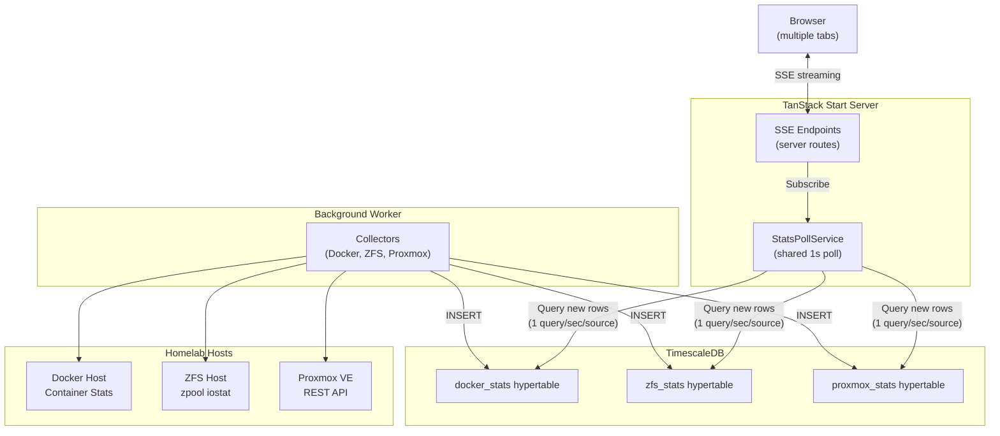
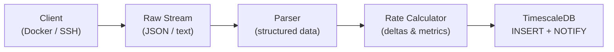
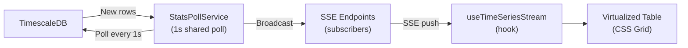

# Architecture

## System Overview

The frontend reads stats from the database, not directly from Docker/ZFS APIs. This enables:
- **Shared polling** — `StatsPollService` runs 1 query/sec per source, broadcasting results to all SSE clients
- **Direct DB queries** with seq-based cursors — no intermediate cache layer
- **Stale data detection** at both global (30+ second warning) and per-entity levels (amber highlighting for individual hosts/containers)

## Data Streaming Pipeline

The application uses a two-stage pipeline: background collection and real-time streaming.

### Stage 1: Background Collection (Worker)

### Stage 2: Real-Time Streaming (Server → Browser)

### How It Works

1. **Background worker** continuously collects stats from Docker/ZFS APIs every 1 second and Proxmox API every 10 seconds (configurable)
2. **Docker collector** keeps stats streams open continuously, flushing every second and only reconnecting on container changes or errors
3. **ZFS collector** streams `zpool iostat` continuously, flushing on each cycle boundary
4. **Proxmox collector** polls the Proxmox REST API at a configurable interval (1s or 10s), converts the cluster overview to flat rows with entity type discriminator, and inserts into TimescaleDB
5. Stats are **inserted** into TimescaleDB wide hypertables
6. **StatsPollService** runs one `setInterval(1s)` per source (docker, zfs, proxmox), querying for new rows using seq-based cursors and broadcasting results to all subscribed SSE endpoints
7. **SSE endpoints** subscribe to the poll service; multiple browser tabs share the same poll — only 1 DB query/sec per source
8. The **`useTimeSeriesStream` hook** preloads history via REST, then merges SSE updates into a time-windowed buffer with stale detection
9. **Virtualized tables** render with CSS Grid + `useWindowVirtualizer` for efficient page-scroll rendering, with per-entity stale indicators

## Proxmox Data Model

Proxmox uses a single wide `proxmox_stats` hypertable with an `entity_type` discriminator column to distinguish cluster, node, qemu, lxc, and storage entities (similar to how ZFS uses `entity_type` for pool/vdev/disk). This keeps the architecture consistent: one table → one StatsPollService source → one SSE stream → one `useTimeSeriesStream` hook.

- **Bidirectional conversion**: `overviewToRows()` converts the Proxmox API overview to flat DB rows; `buildProxmoxOverview()` reconstructs the overview from latest rows per entity
- **Runtime-configurable interval**: The Proxmox poll interval (1s or 10s) can be changed via the settings UI; changes propagate via `SettingsListener` → `ProxmoxCollector.pollInterval` setter
- **Entity ID convention**: nodes use `node` name, guests use `vmid`, storages use `${node}/${storage}` for cross-node uniqueness
