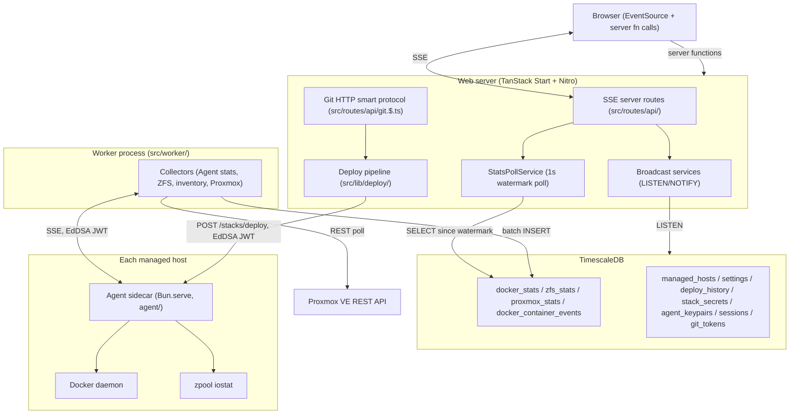
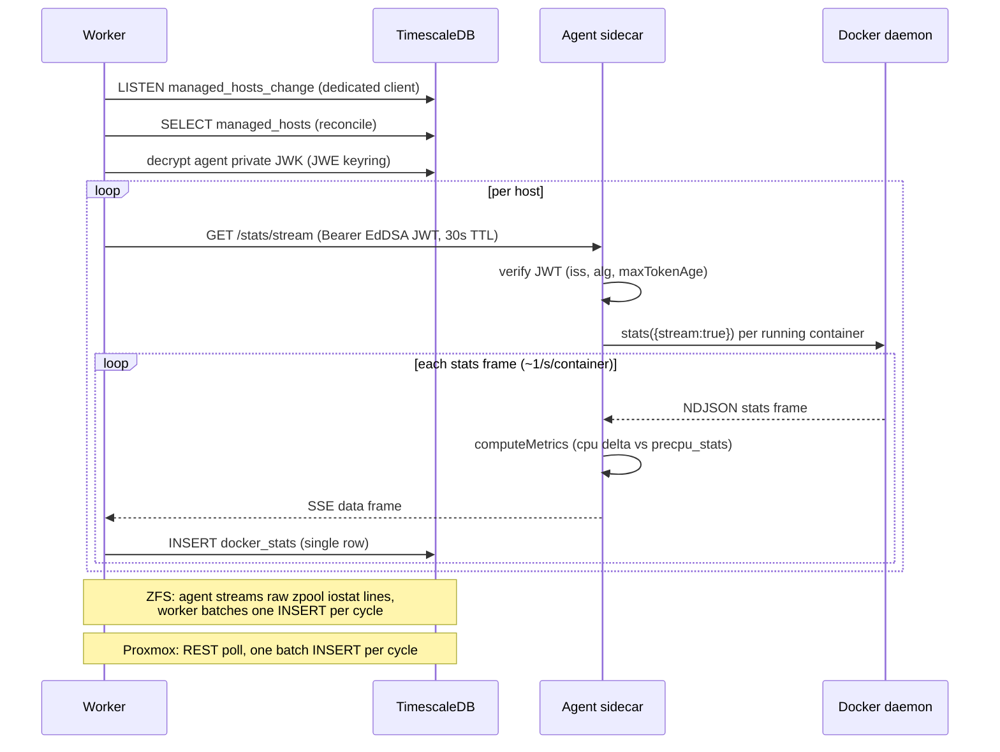

# Data Flow and Pattern Review

Generated 2026-06-11 from commit `5d66d9fe` by tracing the code directly. Existing docs in this
folder were intentionally not used as a source: every claim below is grounded in the code as it
exists at this commit (file paths and approximate line numbers given) or in official documentation
fetched during the review (source URLs given). Line numbers will drift as the code changes; the
file paths and symbol names are the durable references.

Contents:

1. [Technology inventory and alignment summary](#1-technology-inventory-and-alignment-summary)
2. [System overview](#2-system-overview)
3. [Flow: metrics ingestion (write path)](#3-flow-metrics-ingestion-write-path)
4. [Flow: live streaming (read path)](#4-flow-live-streaming-read-path)
5. [Flow: inventory and stack status broadcast (LISTEN/NOTIFY)](#5-flow-inventory-and-stack-status-broadcast-listennotify)
6. [Flow: agent sidecar internals](#6-flow-agent-sidecar-internals)
7. [Flow: deploy pipeline and git management](#7-flow-deploy-pipeline-and-git-management)
8. [Flow: authentication and cryptography](#8-flow-authentication-and-cryptography)
9. [Flow: frontend state and rendering](#9-flow-frontend-state-and-rendering)
10. [Pattern alignment against current guidance](#10-pattern-alignment-against-current-guidance)
11. [Findings and suggested fixes](#11-findings-and-suggested-fixes)

---

## 1. Technology inventory and alignment summary

| Technology | Version in repo | Role | Alignment verdict (details in section 10) |
|---|---|---|---|
| TanStack Start | 1.167.16 (`react-start`) | SPA framework, server functions, server routes | Partially aligns: SPA mode is current, but version drift vs router and the dynamic-import convention diverge from current docs |
| TanStack Router | 1.168.10 | Routing | Version drift vs Start (they ship in lockstep) |
| TanStack Query | 5.100.6 | Request/response caching, preloads | Aligns with community practice for SSE-plus-Query split |
| TanStack Table v8 + react-virtual 3 | 8.21.3 / 3.13.24 | Headless table, virtualization | Aligns; v9 is alpha, no action |
| Nitro | nightly 3.0.1 | Server runtime under Vite | Risk area: nightly dependency with open ecosystem issues |
| Bun | pinned via `.bun-version` | Runtime, test runner, package manager | Aligns; native `AsyncDisposableStack` support since 1.3.12 |
| pg (node-postgres) | 8.20.0 | PostgreSQL client | Aligns; BIGINT coercion and separate INSERT/NOTIFY calls match protocol constraints |
| TimescaleDB | PostgreSQL 16 extension | Hypertables, compression | Aligns on wide tables and live polling; gaps on chunk sizing, retention, and continuous aggregates |
| jose | 6.2.3 | EdDSA JWTs, JWE at-rest encryption | Mostly aligns; missing `aud` claim and decrypt-side algorithm allowlists |
| OIDC (hand-rolled client) | n/a | Login | Diverges: no PKCE, ID token signature not verified |
| SSE (hand-rolled factories) | n/a | Live data transport | Aligns on transport choice; missing periodic heartbeats |
| isomorphic-git + native git | 1.37.6 | Stacks repo | Sound for single instance; process-local mutex documented below |
| MUI v9 + Tailwind v4 + Emotion 11 | 9.0.0 / 4.3.0 | UI | Aligns except the `!`-postfix override mechanism; MUI prescribes cascade layers |
| Jotai | 2.19.1 | Settings state | Aligns (selectAtom slices, SSE-fed atoms) |
| ECharts 6 + echarts-for-react 3 | 6.0.0 / 3.0.6 | Charts | Aligns; wrapper actively maintained, peers include React 19 and ECharts 6 |
| React 19 | 19.2.6 | UI runtime | Partially aligns: React Compiler (stable, recommended for new apps) not enabled; one pattern blocks it |

---

## 2. System overview

Three processes plus per-host sidecars. The browser never talks to Docker, ZFS, or Proxmox
directly; everything flows through TimescaleDB except agent log streaming and exec, which the web
server pipes through.



Key boundary rule: the worker and web server authenticate to agents with per-host Ed25519 JWTs
(30 second TTL, minted per request). Browsers authenticate to the web server with opaque session
cookies validated against the `sessions` table.

---

## 3. Flow: metrics ingestion (write path)

### Lifecycle

`src/worker/collector.ts` is the entry point. It connects to PostgreSQL, runs migrations, then
builds everything inside an `await using stack = new AsyncDisposableStack()` block so SIGTERM and
SIGINT propagate one `AbortController` through every collector and the stack disposes them in
reverse order.

Host management is reactive. `HostsListener` (`src/worker/hosts-listener.ts`) holds a dedicated,
unpooled `pg.Client` doing `LISTEN managed_hosts_change`; `HostRepository` fires `pg_notify` after
every create/update/delete. The listener triggers `HostCollectorManager.reconcile()`
(`src/worker/host-collector-manager.ts`), which serializes runs through a promise chain:

```typescript
reconcile(): Promise<void> {
  const next = this.reconcileChain.then(() => this.reconcileOnce());
  this.reconcileChain = next.catch(() => {});
  return next;
}
```

LISTEN is started before the initial reconcile so a notification arriving during the first
`findAll()` queues a follow-up reconcile instead of being lost (`src/worker/collector.ts`, around
lines 109-148).

All collectors extend `BaseCollector` (`src/worker/collectors/base-collector.ts`): a
`while (!aborted)` loop calling the subclass `collect()`, with exponential backoff only on error
(`min(500 * 2^n, 30000)` ms, exponent capped at 5, so 16 s max in practice) and immediate
reconnect on clean stream end.

### Per-source behavior

| Collector | Transport | Insert granularity |
|---|---|---|
| `AgentStatsCollector` | SSE from agent `/stats/stream` | One INSERT per container per second (see finding F1) |
| `ZFSCollector` | SSE from agent `/zfs/stats/stream` (raw `zpool iostat -v 1` lines) | One batch INSERT per iostat cycle (correct batching) |
| `ContainerInventoryCollector` | SSE from agent `/containers/events` | One INSERT per state change, 250 ms flap coalescing |
| `ProxmoxCollector` | Direct REST polling | One batch INSERT per poll cycle (correct batching) |

The Docker stats path parses each SSE frame and immediately writes a single row
(`src/worker/collectors/agent-stats-collector.ts:122`):

```typescript
await this.repository.insertDockerStats([row]);  // always a one-element array
```

`StatsRepository.insertDockerStats` (`src/lib/database/repositories/stats-repository.ts`) is built
on the unnest pattern and accepts arbitrarily large arrays:

```sql
INSERT INTO docker_stats (time, host, container_id, ...)
SELECT * FROM unnest($1::timestamptz[], $2::text[], $3::text[], ...)
```

so batching capability exists but is unused on the hottest path. See finding F1.

The inventory collector coalesces container flapping: a start/stop/restart burst within 250 ms
collapses to one write of the final state (`container-inventory-collector.ts`, `FLAP_WINDOW_MS`).
The NOTIFY for inventory changes is a database trigger
(`migrations/018_docker_container_events.sql`), so the notification is atomic with the INSERT and
explicitly excludes `labels` because PG NOTIFY payloads are capped at 8000 bytes.

The Proxmox collector polls `getClusterOverview()`, which fans out to
`3 * onlineNodes` parallel requests (VMs, containers, storage per node) per cycle. Proxmox exposes
`/cluster/resources`, which returns all entity types in one call; see finding F4.

### Schema

All four hypertables use wide rows, segment-by compression on `(host, entity)` dimensions, and a
7-day compression policy (`migrations/002`, `004`, `007`, `008`, `018`). There are no retention
policies (removed in migration 007), no custom `chunk_time_interval` (default 7 days), and no
continuous aggregates. History preloads use `time_bucket` over raw rows targeting roughly 300
points per window. See findings F5 and F6.

### Sequence



---

## 4. Flow: live streaming (read path)

### Server side

Two factories in `src/lib/sse/` own the SSE boilerplate. Both return a `Response` wrapping a
`ReadableStream`, enqueue one `': ok\n\n'` comment to force Nitro to flush headers, guard every
enqueue behind a shared `closed` flag, and tear down via `request.signal`:

```typescript
// src/lib/sse/create-stats-sse-handler.ts (abridged)
controller.enqueue(encoder.encode(': ok\n\n'));
const unsubscribe = statsPollService.subscribe(source, sendData, sendError);
request.signal.addEventListener('abort', teardown);
```

There is no periodic heartbeat after that first comment, no `id:` field, no `retry:` field, and no
`Last-Event-ID` handling (verified by grep; the only enqueues of comments are the initial flush).
See findings F7 and F8.

`StatsPollService` (`src/lib/database/subscription-service.ts`) is a module singleton. Per source:

- Polling starts on the first subscriber and stops (interval cleared, watermark deleted) on the
  last unsubscribe, so an idle server does zero DB work.
- Each 1 s tick queries `WHERE time > watermark - 200ms ORDER BY time ASC`, advances the watermark
  to the max returned row time, and broadcasts. The 200 ms lookback catches late commits; the
  frontend dedup map absorbs the overlap.
- After 3 consecutive failed ticks it emits a named `event: stats_error` frame; the interval keeps
  firing at 1 s with no backoff while the DB is down (finding F9).

### Client side

`useEventSource` (`src/hooks/useEventSource.ts`) disables the browser's native reconnect (it closes
the source in `onerror`) and implements manual backoff: 1 s doubling to 16 s, maximum 5 attempts,
then a terminal error state. A `visibilitychange` handler resets the counter and reconnects, but
only fires when the tab is hidden and shown again; a continuously visible tab that exhausts its 5
attempts never recovers without a reload (finding F10). The hook listens for the default `message`
event plus the hard-coded `stats_error` named event; error events emitted by the broadcast handlers
(`settings_error` and friends) are never received (finding F11).

`useTimeSeriesStream` (`src/hooks/useTimeSeriesStream.ts`) composes:

- preload via TanStack Query (`time_bucket` history server function, 8 s timeout, `initialData`
  fast path when the Query cache is fresh),
- `useSSEBuffer` (`src/hooks/timeSeriesStream/useSSEBuffer.ts`): O(1) enqueue into a pending queue,
  1 s flush that dedups, sorts, and merges with binary-search eviction and structural sharing,
- staleness detection (banner after 30 s without data), 60 s periodic refresh on the Docker page,
  and a visibility-triggered refresh with a 5 s cooldown.

Reconnect gaps are real but bounded: there is no replay (`Last-Event-ID`), so rows emitted during a
disconnect are lost to that client until the next periodic or visibility refresh. For
snapshot-style metrics this is the standard tradeoff (see section 10, SSE), but wiring the
existing refresh to fire on SSE reconnect would close most of the gap cheaply (finding F8).

### Sequence

```mermaid
sequenceDiagram
    participant B as Browser
    participant R as SSE route (factory)
    participant P as StatsPollService
    participant PG as TimescaleDB

    B->>R: GET /api/docker-stats (EventSource)
    R->>R: authenticateSSE (session cookie)
    R->>P: subscribe('docker', sendData, sendError)
    P->>P: first subscriber: start 1s interval, watermark = now
    R-->>B: ': ok' comment (flush headers)
    loop every 1s
        P->>PG: SELECT * FROM docker_stats WHERE time > watermark - 200ms
        PG-->>P: new rows
        P->>P: filter time > watermark, advance watermark
        P-->>B: data: [rows] (per subscriber)
        B->>B: enqueue to pending buffer
    end
    loop every updateIntervalMs (1s)
        B->>B: flush: dedup, sort, merge with eviction, setState
    end
    B->>R: close EventSource (navigate away)
    R->>P: unsubscribe; last one stops polling, deletes watermark
```

---

## 5. Flow: inventory and stack status broadcast (LISTEN/NOTIFY)

Three broadcast services follow the same shape: a dedicated `PoolClient` held outside the pool
rotation, `LISTEN` issued before the initial snapshot load (so nothing is missed during the load),
reconnect with exponential backoff, and a full state re-sync pushed to subscribers after every
reconnect. This matches the canonical LISTEN/NOTIFY pattern, which assumes notifications can be
missed and treats them as wake-up signals rather than data
(see section 10, LISTEN/NOTIFY).

| Service | Channels | Re-sync on reconnect |
|---|---|---|
| `SettingsBroadcastService` (`src/lib/settings/settings-broadcast-service.ts`) | `settings_change` | full settings snapshot to all subscribers |
| `StackStatusBroadcastService` (`src/lib/stacks/stack-status-broadcast-service.ts`) | `docker_container_change`, `deploy_change` | reloads container snapshot from DB |
| `DockerInventoryBroadcastService` (`src/lib/docker/docker-inventory-broadcast-service.ts`) | `docker_container_change` | new `init` snapshot |

Two details worth knowing:

- The inventory NOTIFY payload omits `labels` (8000 byte cap), so the client merges labels from its
  previous snapshot (`useDockerInventory.ts`). A container created while connected has empty labels
  until the next `init` event.
- Destroy events carry no compose project label, so `StackStatusBroadcastService` scans all stacks
  to locate the container being removed.

By contrast, the worker's own `HostsListener` does not reconnect: its `error` handler logs and
stops. A PostgreSQL restart leaves the worker running with stale collector state until the worker
itself restarts (finding F2).

---

## 6. Flow: agent sidecar internals

The agent (`agent/src/index.ts`) is a raw `Bun.serve()` with a hand-written route matcher, no
framework. Startup hard-exits if no trusted public key is configured (it polls
`AGENT_TRUSTED_PUBKEY_FILE` for up to 60 s) and rejects JWKs that contain a private component.

Auth (`agent/src/middleware.ts`, `agent/src/lib/jwt-auth.ts`): every route except `/health`
requires a Bearer JWT verified with

```typescript
await jwtVerify(jwt, publicKey, {
  issuer: 'homelab-manager',
  algorithms: ['EdDSA'],
  maxTokenAge: '30s',
});
```

Algorithm pinning and issuer checks are correct. There is no `aud` claim on either side and no
clock skew tolerance (findings F12, F13).

### Stats streaming

`agent/src/routes/stats.ts` opens one `container.stats({ stream: true })` Dockerode stream per
running container and multiplexes them onto a single SSE response. The CPU formula matches the
Docker CLI (delta of `cpu_usage.total_usage` vs the daemon-provided `precpu_stats`, scaled by
online CPUs). A 60 s refresh loop reconciles the container set; a circuit breaker closes the
stream after 10 consecutive refresh failures. Cleanup is wired to `request.signal`. There is no
heartbeat on this stream (the logs route has a 5 s one), and no cap on simultaneous container
streams: a 500-container host means 500 concurrent connections to the Docker daemon (findings F7,
F14).

### Deploy execution

`agent/src/routes/stacks.ts` receives compose and env content as plain strings in the JSON body
(1 MB / 64 KB limits), validates stack names against `^[a-zA-Z0-9][a-zA-Z0-9_-]*$` plus a
`relative()`-based containment check, writes `docker-compose.yml` and `.env` under `STACKS_DIR`,
and runs `docker compose ... up -d --remove-orphans` via `Bun.spawn` with array args (no shell
interpolation anywhere) and a 5 minute timeout. `forceRecreate` first resolves the compose file
with `docker compose config` and force-removes explicitly named containers.

The `.env` file lands on disk in plaintext with default permissions; compose requires a file, but
tightening to mode 0600 is a cheap improvement (finding F15).

### Exec and updater

`agent/src/routes/exec.ts` allows only an allowlisted set of shells (`bash`, `sh`, `ash`, `zsh`)
and works around Bun's `node:http` not emitting `upgrade` for Docker's hijacked TCP connection by
speaking the HTTP/1.1 upgrade by hand on a raw socket. `agent-updater/` is a second sidecar that
pulls a new agent image, recreates the container with the old config, health-checks it, and rolls
back on failure; it requires the Docker socket mounted directly.

---

## 7. Flow: deploy pipeline and git management

### Pipeline

`src/lib/deploy/pipeline.ts` is trigger-agnostic. Steps: validate host, resolve secrets, detect
no-op deploys by hash, claim the concurrency slot, optionally stop for manual approval, dispatch
to the agent, record the result, fire NOTIFY.

Secret resolution: `${VAR}` references are extracted from the compose content and decrypted from
`stack_secrets` (JWE, `dir` + `A256GCM`, keyed by `kid`). The resolved values are appended to
`envContent` as single-quoted `KEY='value'` lines; trigger builders always pass `envContent: ''`
so plaintext secrets exist only inside the pipeline and the dispatch body.

Concurrency is enforced by the database, not application locks
(`migrations/011_deploy_active_unique.sql`):

```sql
CREATE UNIQUE INDEX idx_deploy_one_active_per_stack_host
  ON deploy_history (stack, host)
  WHERE status IN ('pending', 'in_progress');
```

`insertDeployIfNoActive` returns null on a `23505` violation of exactly this index, and the
pipeline reports the deploy as failed. Because at most one row can be pending or in_progress per
stack and host, the `deduplicatePending` cleanup that follows is defensive code that cannot find
anything to delete under normal operation. The real consequence of this design is queueless
rejection: a git push that arrives while a deploy is active is dropped rather than queued, so the
newest commit may never deploy (finding F16).

Crash safety is two-layered: on startup, `recoverStuckDeploys` bulk-fails every `pending` and
`in_progress` row (safe only because the system is single-instance), and `DeployWatchdog` fails
`in_progress` rows older than 10 minutes every 2 minutes thereafter. The 10 minute threshold is
double the agent's 5 minute compose timeout; an agent that legitimately finishes after the
watchdog fired will throw `Deploy record not found when updating status` when it reports back, and
the deploy stays failed (acceptable, but worth knowing when reading logs).

### Git

The stacks repo is a server-side bare repo. Two writers are serialized per repo path by a
process-local promise-chain mutex (`src/lib/git/repo.ts:withRepoLock`): UI commits via
isomorphic-git (`writeBlob`/`writeTree`/`writeCommit`) and pushes via native
`git receive-pack --stateless-rpc` spawned by the smart-protocol route
(`src/routes/api/git.$.ts`). The mutex is per process; running two web server instances against
the same repo directory would race (documented single-instance assumption, finding F17).

Git HTTP auth is independent of `AUTH_ENABLED`: every request fetches all rows from `git_tokens`,
decrypts each (JWE), and compares hashes with `timingSafeEqual`. This is O(tokens) decryptions per
git request (finding F18).

After a push, the route compares HEAD before and after and fires `processPostReceive`
fire-and-forget so the push completes immediately from the client's perspective. The post-receive
flow diffs the two trees by blob OID, maps changed paths to top-level stack directories, reads
`manifest.yaml` at the new HEAD (Zod-validated), and builds deploy requests with `autoApproved`
taken from each manifest entry's `autoDeploy` flag.

### Sequence: git push to running containers

```mermaid
sequenceDiagram
    participant U as git client
    participant G as git.$ route
    participant Repo as bare repo
    participant PR as post-receive
    participant P as Deploy pipeline
    participant A as Agent
    participant PG as DB
    participant UI as Browser (SSE)

    U->>G: POST git-receive-pack (token auth)
    G->>Repo: withRepoLock: git receive-pack --stateless-rpc
    G-->>U: push result (response sent)
    G->>PR: processPostReceive(oldHead, newHead) fire-and-forget
    PR->>Repo: diff trees by blob OID, read manifest.yaml at newHead
    PR->>P: execute(DeployRequest) per changed stack (sequential per host)
    P->>PG: decrypt stack_secrets, hash compare vs last success
    P->>PG: INSERT deploy_history (partial unique index gates concurrency)
    P->>A: POST /stacks/deploy (compose + env strings, EdDSA JWT)
    A->>A: write files, docker compose up -d
    A-->>P: { status, stdout, stderr }
    P->>PG: UPDATE status; pg_notify('deploy_change', ...)
    PG-->>UI: stack-status SSE: deploy_changed
```

---

## 8. Flow: authentication and cryptography

### OIDC login (when `AUTH_ENABLED=true`)

The client is hand-rolled (`src/lib/auth/oidc-client.ts`), authorization code flow with `state`
and `nonce` but no PKCE, and the ID token payload is base64url-decoded without signature
verification (`oidc-client.ts:133-139`, verified):

```typescript
static extractIdTokenClaims(idToken: string): Record<string, unknown> {
  const parts = idToken.split('.');
  // ... base64url decode of parts[1], no jwtVerify
```

The code comment argues the TLS token-endpoint exchange makes verification redundant. That holds
for a well-behaved confidential client against an honest provider, but it diverges from the OIDC
spec and from RFC 9700 (OAuth Security BCP, 2025), which requires PKCE for all clients including
confidential ones (findings F19, F20).

Sessions are opaque 256-bit random tokens; the DB stores only `SHA-256(token)` as the primary key
with `expires_at` enforced in SQL, which avoids timing oracles and means a DB leak does not leak
usable tokens. The full OIDC token set (access, refresh, ID token) is JWE-encrypted into the
session row, though only the ID token is ever used again (logout hint, finding F21). The session
cookie is `HttpOnly; SameSite=Lax; Path=/` with `Secure` only when the redirect URI is https, and
has no `Max-Age`, so it is a browser-session cookie backed by an absolute server-side TTL
(`SESSION_TTL_HOURS`, default 8). Absolute-only expiry is the conservative side of OWASP guidance;
the missing `Max-Age` is finding F22.

When `AUTH_ENABLED` is anything other than the exact string `true` (including unset, `True`, `1`),
every middleware injects a synthetic admin and the entire app is open. Git HTTP token auth is the
one path that stays independently authenticated. The default-open posture is documented, but the
strict string match makes misconfiguration silent (finding F23).

```mermaid
sequenceDiagram
    participant B as Browser
    participant S as Web server
    participant IdP as OIDC provider

    B->>S: GET /api/auth/login
    S->>S: state, nonce = randomBytes(32) each
    S-->>B: 302 to IdP; Set-Cookie oidc_state (HttpOnly, Lax, Path=/api/auth, 600s)
    B->>IdP: authorize (response_type=code, state, nonce)
    IdP-->>B: 302 /api/auth/callback?code&state
    B->>S: callback (cookie: oidc_state)
    S->>S: state equality check vs cookie
    S->>IdP: POST /token (code, client_secret)
    IdP-->>S: access + id + refresh tokens
    S->>IdP: GET /userinfo (groups)
    S->>S: decode id_token payload (NO signature verify), nonce check
    S->>S: map groups to role (admin > operator > viewer), upsert user
    S->>S: rawToken = random(32); store SHA-256(rawToken) + JWE(tokens)
    S-->>B: 302 /; Set-Cookie session=rawToken (HttpOnly, Lax, no Max-Age)
```

### Agent auth and at-rest encryption

Each managed host gets its own Ed25519 keypair at enrollment
(`src/lib/database/repositories/agent-keypairs-repository.ts`): the private JWK is stored as JWE,
the public JWK is handed to the operator for `AGENT_TRUSTED_PUBKEY`. Callers mint a fresh JWT per
request (`src/lib/crypto/agent-jwt.ts`): `iss`, `sub = hostName`, `jti`, `iat`, 30 s `exp`. The
per-host keys bound the blast radius of a key compromise; missing `aud` and zero clock tolerance
are the gaps (findings F12, F13).

The at-rest keyring (`src/lib/crypto/master-key.ts`, `encrypted-value.ts`) is JWE compact with
`alg: dir`, `enc: A256GCM`, `kid` in the protected header. Keys load from `MASTER_KEY[_<KID>]` or
file variants; the lexicographically last KID encrypts, all keys decrypt. `compactDecrypt` selects
the key by header `kid` but does not restrict `keyManagementAlgorithms`/
`contentEncryptionAlgorithms` (finding F24). Encrypted columns: `stack_secrets.ciphertext_jwe`,
`agent_keypairs.private_jwk_jwe`, `sessions.encrypted_oidc`, `git_tokens.encrypted_token`. The
rotation CLI (`scripts/migrate-master-key.ts`) re-encrypts per row in its own transaction and
intentionally skips sessions and git tokens (they rotate naturally).

---

## 9. Flow: frontend state and rendering

### Three state stores, deliberately split

1. **Jotai for settings.** One SSE stream (`/api/settings`) feeds `rawSettingsAtom`; a derived
   `settingsAtom` parses it; domain atoms (`dockerSettingsAtom` etc.) are `selectAtom` slices with
   custom structural equality so Set re-creation does not cause re-renders
   (`src/hooks/settingsAtom.ts`). Optimistic writes update the atom first and roll back on server
   failure (`useOptimisticSetting.ts`); the eventual SSE `change` echo is idempotent.
2. **TanStack Query for request/response data.** History preloads, icons, hosts, stacks, deploy
   history. The QueryClient is a module singleton (`src/lib/query-client.ts`).
3. **A purpose-built SSE buffer for time series.** `useSSEBuffer` holds the rolling window outside
   the Query cache. The preload snapshot lives in both stores by design: Query owns caching and
   `staleTime`, the buffer owns the live merge. Community guidance for Query plus push transports
   endorses keeping high-frequency streams out of the cache (section 10).

### Render path for one stats tick

SSE frame arrives, `useEventSource` parses it, `useSSEBuffer` queues it; on the 1 s flush the
buffer dedups/merges/evicts and triggers one render. `useLatestByEntity` returns a
structurally-shared Map; `ContainerTable` memos rebuild per-entity stats and chart arrays with
reference-reuse checks; `DataTable` (TanStack Table v8, CSS Grid rows) virtualizes above 150 rows
via `useVirtualizer` and relies on `content-visibility: auto` below it; `SparklineCell`
accumulates points in refs mutated during render (documented tradeoff: with ~170 sparklines,
`setState` per cell would mean ~170 extra commits per tick), and `SparklineCanvas` draws on an
IntersectionObserver-gated rAF loop with pre-allocated `Float64Array` buffers and a cached
gradient.

```mermaid
flowchart LR
    SSE["SSE frame"] --> ES["useEventSource<br/>JSON.parse"]
    ES --> Buf["useSSEBuffer<br/>pending queue"]
    Buf -->|"1s flush: dedup, sort,<br/>merge + evict"| Rows["sortedRows state"]
    Rows --> Latest["useLatestByEntity<br/>(structural sharing)"]
    Latest --> CT["ContainerTable memos<br/>statsByEntityId / chartDataByEntityId"]
    CT --> DT["DataTable<br/>(virtualize > 150 rows)"]
    DT --> MC["MetricCell (memo)"]
    MC --> SC["SparklineCell<br/>(render-time ref accumulator)"]
    SC --> Canvas["SparklineCanvas<br/>(visible-only rAF, Float64Array)"]
```



Known hotspots: `chartDataByEntityId` walks the full row window every flush (O(window) with
hundreds of containers), and `SparklineCell`'s `memo` is defeated because the per-entity chart
arrays are rebuilt each flush, so all cells re-render every tick and rely on the internal
timestamp gate to skip work (finding F25).

### Demo mode

`VITE_DEMO_MODE=true` swaps the five `@/data/*/functions` barrels for mocks via Vite aliases
(registered before the generic `@` alias, `vite.config.ts`) and patches `window.EventSource` with
a generator-backed mock. Routes, hooks, and components are untouched, which is what keeps the demo
honest as a regression surface.

### Server function discipline

All server functions follow `createServerFn().middleware([...]).inputValidator(zod).handler()`
with every server-only import done as `await import()` inside the handler. This works, and the
repo enforces it for a real historical reason (client bundle breakage via `node:async_hooks`), but
current TanStack Start documents compiler-level import protection (`*.server.ts` naming, the
`server-only` marker, automatic pruning of static handler imports) as the supported mechanism; see
section 10 and finding F26.

---

## 10. Pattern alignment against current guidance

Verdicts below come from documentation fetched 2026-06-11. Code always wins over docs when they
describe the repo.

### TanStack Start

- **SPA mode**: the repo uses both `tanstackStart({ spa: { enabled: true } })` and per-route
  `ssr: false`. Current docs offer `createStart(() => ({ defaultSsr: false }))` to set the default
  once instead of repeating it per route.
  [Selective SSR](https://tanstack.com/start/latest/docs/framework/react/guide/selective-ssr),
  [SPA mode](https://tanstack.com/start/latest/docs/framework/react/guide/spa-mode). Verdict:
  partially aligns (works, more verbose than current idiom).
- **Server routes for SSE**: official docs do not cover long-lived streams at all; the repo's
  pattern (ReadableStream, `request.signal` teardown, header flush) matches the prevailing
  community pattern. Verdict: aligns, with the heartbeat gap noted in F7.
- **Dynamic `await import()` for server-only code**: superseded as the documented mechanism by
  [import protection](https://tanstack.com/start/latest/docs/framework/react/guide/import-protection)
  (`*.server.ts`, `import '@tanstack/react-start/server-only'`, compiler pruning of handler
  imports, `importProtection.behavior: 'error'`). Verdict: diverges from current docs while
  remaining functional; see F26 before changing anything.
- **Versions**: `react-start` 1.167.16 and `react-router` 1.168.10 are out of lockstep; Start and
  Router ship from one monorepo and are meant to be pinned together
  ([releases](https://github.com/TanStack/router/releases)). Start is still a 1.0 release
  candidate. Verdict: fix the drift (F27).
- **Nitro nightly**: nitro is optional for Start; the docs-listed Bun path can also be a custom
  `Bun.serve()` around the no-nitro build output. Open issues relevant to this stack include
  dev-mode server-route redirect breakage (affects OAuth callbacks,
  [#5220](https://github.com/TanStack/router/issues/5220)) and Vite 8 + nitro v3 reports of
  non-responding builds ([rolldown-vite #580](https://github.com/vitejs/rolldown-vite/issues/580)).
  Verdict: highest-churn dependency in the stack; de-risking option exists (F28).

### TanStack Query + SSE

Official Query ships `streamedQuery` for finite streams; for infinite push channels the
maintainer-endorsed pattern is subscribing outside Query and using the cache only for
request/response data ([discussion #418](https://github.com/TanStack/query/discussions/418),
[TkDodo on WebSockets + Query](https://tkdodo.eu/blog/using-web-sockets-with-react-query)). The
repo's REST-preload-plus-external-buffer split matches this. Verdict: aligns.

### TimescaleDB

([wide vs narrow](https://www.tigerdata.com/learn/designing-your-database-schema-wide-vs-narrow-postgres-tables),
[chunk sizing](https://www.tigerdata.com/blog/timescale-cloud-tips-testing-your-chunk-size),
[columnstore policy](https://www.tigerdata.com/docs/reference/timescaledb/hypercore/add_columnstore_policy),
[insert guidance](https://www.tigerdata.com/blog/boosting-postgres-insert-performance))

- Wide hypertables: aligns (NULLs compress to almost nothing in columnstore chunks).
- 1 s watermark polling for the live tail: aligns; no doc recommends caggs for sub-minute live data.
- Multi-row inserts: guidance says batch 500-5000 rows per statement; the Docker path inserts one
  row at a time (F1).
- Chunk interval: default 7 days; the working-set rule (active chunks + indexes within ~25% of
  memory) suggests 1-day chunks at 1 Hz scale (F5).
- History over raw rows: continuous aggregates with real-time mode are the documented tool for
  long-window history; the repo has none (F6).
- API naming: `add_compression_policy` still works; new migrations could use the 2.18+
  `add_columnstore_policy` naming. Cosmetic.

### LISTEN/NOTIFY

Payloads under 8000 bytes, dedicated unpooled clients, LISTEN-before-snapshot, full re-sync on
reconnect: all match the canonical pattern
([PostgreSQL NOTIFY docs](https://www.postgresql.org/docs/current/sql-notify.html)). The web-side
broadcast services implement all of it; the worker's `HostsListener` lacks the reconnect half (F2).
Verdict: aligns on the web side, gap on the worker side.

### Bun

`request.signal` teardown and `AsyncDisposableStack` usage align with current Bun guidance; the
known SSE footgun is `idleTimeout` killing quiet streams
([Bun.serve docs](https://bun.com/docs/runtime/http/server)), which periodic heartbeats (F7) also
mitigate. pg 8.x on Bun has no outstanding critical issues; a global
`pg.types.setTypeParser(20, ...)` would centralize the BIGINT coercion the repo currently does
per-converter (optional).

### SSE transport choice

2026 guidance keeps SSE the default for server-to-client-only dashboards over WebSocket and
WebTransport ([websocket.org comparison](https://websocket.org/comparisons/sse/)). Skipping
`Last-Event-ID` replay is the recommended call for snapshot-semantics metrics where the next tick
supersedes missed ones; replay buffers only pay off for append-only feeds. The repo's choice
aligns. Two transport-level gaps remain: heartbeats (F7) and the HTTP/1.1 six-connections-per-origin
limit when several EventSources are open across tabs, which makes HTTP/2 at the reverse proxy a
deployment requirement worth documenting (F29).

### jose / JWT / JWE

EdDSA with pinned algorithms and short TTLs matches current recommendations
([Curity JWT best practices](https://curity.io/resources/learn/jwt-best-practices/)); 30 s
per-request tokens are stricter than the typical 5-15 minute machine-token band, which is fine.
Gaps vs the checklist: no `aud` (F12), no clock tolerance (F13), no decrypt-side algorithm
allowlists (F24). `dir` + `A256GCM` JWE for column encryption is a sound, standard choice; the
keyring/KID rotation design matches the textbook pattern.

### OIDC

RFC 9700 requires PKCE for all clients, confidential included
([oauth.net PKCE](https://oauth.net/2/pkce/)); ID token signature verification against the
provider JWKS is a spec requirement
([Auth0 on state/nonce/PKCE](https://auth0.com/blog/demystifying-oauth-security-state-vs-nonce-vs-pkce/)).
The repo has state and nonce but neither PKCE nor signature verification (F19, F20). Session
cookie practice is otherwise close to OWASP guidance (HttpOnly, Lax, hashed server-side lookup,
absolute TTL); missing `Max-Age` and the `__Host-` prefix are the deltas (F22).

### UI stack (MUI v9, Tailwind v4, Jotai, ECharts, React 19, react-virtual)

All verdicts verified against documentation fetched 2026-06-11.

- **MUI v9 styling engine**: Emotion is still the runtime engine in v9; Pigment CSS remains alpha
  ([v9 release blog](https://mui.com/blog/introducing-material-ui-v9/),
  [Pigment repo](https://github.com/mui/pigment-css)). The repo's Emotion 11 dependency is
  correct. `cssVariables` theme mode is stable and recommended
  ([docs](https://mui.com/material-ui/customization/css-theme-variables/overview/)); its caveats
  are SSR-oriented and do not apply to this `ssr: false` SPA. Verdict: aligns.
- **MUI + Tailwind override mechanism**: MUI publishes an official Tailwind v4 interop guide
  ([integration doc](https://mui.com/material-ui/integrations/tailwindcss/tailwindcss-v4/)) whose
  prescribed mechanism is `enableCssLayer: true` plus
  `@layer theme, base, mui, components, utilities;` so Tailwind utilities beat MUI styles by
  cascade-layer order with no `!important`. The repo instead relies on the `!` postfix
  (CLAUDE.md rule 1) and uses neither `@layer` nor `enableCssLayer` (verified by grep). The
  Tailwind-instead-of-sx policy itself is a project choice MUI supports but does not prescribe.
  Verdict: diverges on the override mechanism (finding F30).
- **Tailwind v4 idioms**: CSS-first config via `@import "tailwindcss"`, the `utility!` postfix,
  `@tailwindcss/vite`, and `@source` all match current v4.3 docs exactly
  ([directives](https://tailwindcss.com/docs/functions-and-directives),
  [utility classes](https://tailwindcss.com/docs/styling-with-utility-classes),
  [Vite install](https://tailwindcss.com/docs/installation/using-vite)). Verdict: aligns.
- **Jotai**: `selectAtom` with custom equality for slice subscriptions and
  `store.set` from outside React for push sources are both first-class documented patterns
  ([selectAtom](https://jotai.org/docs/utilities/select),
  [store outside React](https://jotai.org/docs/guides/using-store-outside-react)). The repo
  reaches the same result through a hook-level `setRaw` fed by the SSE hook, which is equivalent.
  Verdict: aligns.
- **React 19 / React Compiler**: React Compiler 1.0 is stable (October 2025) and the official
  position is that new apps should enable it and lean on it instead of manual memoization
  ([compiler 1.0 announcement](https://react.dev/blog/2025/10/07/react-compiler-1)). The repo
  does not use it (verified). Separately, react.dev and the `eslint-plugin-react-hooks` `refs`
  rule state refs must not be read or written during render; `SparklineCell` mutates accumulator
  refs during render as a documented performance tradeoff. That pattern is incompatible with
  enabling the compiler later (finding F31). Verdict: partially aligns.
- **ECharts 6 + echarts-for-react 3**: the wrapper is actively published (3.0.6, ~Jan 2026) and
  its peer ranges include React 19 and ECharts 6
  ([package.json](https://raw.githubusercontent.com/hustcc/echarts-for-react/master/package.json)).
  Canvas renderer for frequently-redrawn charts and `lazyUpdate` for rapid updates match the
  official handbook ([canvas vs SVG](https://echarts.apache.org/handbook/en/best-practices/canvas-vs-svg/)).
  Verdict: aligns.
- **Virtualization**: TanStack Virtual v3 with developer-owned absolute-positioned markup is the
  current documented pattern ([docs](https://tanstack.com/virtual/latest)), and
  `content-visibility: auto` with `contain-intrinsic-size` is Baseline-available and recommended
  as the lighter alternative below scale thresholds
  ([web.dev](https://web.dev/articles/content-visibility)). The 150-row cutoff is a project
  heuristic with no official source, which is fine. Verdict: aligns.

---

## 11. Findings and suggested fixes

Ordered by expected impact. "Verified" means confirmed directly in the code during this review;
the rest were reported by code tracing and are high confidence but re-check line numbers before
acting.

### High impact

**F1. Docker stats are inserted one row at a time.** Verified:
`src/worker/collectors/agent-stats-collector.ts:122` calls `insertDockerStats([row])` per SSE
frame. A 50-container host issues 50 INSERT round-trips per second; TimescaleDB guidance is
500-5000 rows per multi-row INSERT. The unnest SQL already accepts arrays.
*Fix:* accumulate rows per host and flush on a short interval (100-250 ms) or per
`reader.read()` batch, whichever comes first. Keep the ZFS collector's per-cycle batching as the
model. Also batch the three `entity_metadata` upserts per new container into one statement.

**F7. No periodic SSE heartbeats (web factories and most agent streams).** Verified: both
factories send only the initial `: ok` flush comment
(`src/lib/sse/create-stats-sse-handler.ts:27`, `create-broadcast-sse-handler.ts:53`); on the agent
only the logs route heartbeats. Reverse proxies (nginx default ~60-75 s idle) and Bun's
`idleTimeout` kill quiet streams: settings and stack-status can be quiet for hours, and an idle
docker page goes quiet whenever no rows return. The client then burns reconnect attempts toward
its 5-attempt cap.
*Fix:* add a 25 s `setInterval` comment ping inside both factories (cleared in teardown) and to
the agent stats/zfs/events streams. 25 s stays under common 30 s proxy defaults.

**F19. OIDC: no PKCE.** Verified absent from `src/lib/auth/oidc-client.ts`. RFC 9700 requires
PKCE for all authorization code clients, including confidential ones; it defends against code
injection independently of `state` and `nonce`.
*Fix:* generate a `code_verifier` alongside state/nonce, store it in the `oidc_state` cookie, send
`code_challenge` + `code_challenge_method=S256` on the authorize redirect and `code_verifier` on
the token exchange. Pocket ID supports PKCE.

**F20. OIDC: ID token signature never verified.** Verified:
`oidc-client.ts:133-139` base64url-decodes the payload directly. The nonce check then binds to an
unauthenticated document.
*Fix:* verify with `jose.jwtVerify` against `createRemoteJWKSet(new URL(jwks_uri))` from
discovery, pinning issuer, audience (client_id), and the provider's advertised algorithms; then
read claims. Alternatively adopt `openid-client` (same author as jose) and delete the hand-rolled
exchange.

**F16. Pushes during an active deploy are dropped, not queued.** The partial unique index
(`migrations/011_deploy_active_unique.sql`) correctly enforces one active deploy per stack and
host, but the pipeline reports the blocked request as failed and nothing retries it. A git push
landing while a previous deploy runs means the newest commit silently never deploys (the UI shows
a failed row, but nothing reconciles to the latest desired state). Note: an earlier analysis
suggested a `deduplicatePending` double-deploy race; the unique index makes that impossible since
at most one pending/in_progress row can exist, which also makes `deduplicatePending`
(`deploy-repository.ts:145`) dead code in practice.
*Fix:* on a `23505` rejection for a `git_push` trigger, record the request as `superseded`/queued
and re-run the newest queued request for that stack+host when the active deploy reaches a terminal
state (the pipeline already has the completion hook where it fires NOTIFY). That converges to
latest-desired-state semantics, which is what GitOps users expect.

**F2. Worker `HostsListener` never reconnects.** Its dedicated LISTEN client logs errors and goes
silent; after a PostgreSQL restart the worker keeps stale collectors until the process restarts
(`src/worker/hosts-listener.ts`). The three web-side broadcast services already implement the
correct reconnect-with-backoff plus re-sync loop.
*Fix:* mirror that loop: on client error, reconnect with backoff, re-issue LISTEN, then call
`hostManager.reconcile()` as the re-sync step.

### Medium impact

**F8. Reconnect gaps are only healed by timers, not by the reconnect itself.** No `id:`/
`Last-Event-ID` (the right call for snapshot metrics), but `useTimeSeriesStream` only refreshes on
a 60 s timer or visibility change, so a mid-session network blip leaves a visible gap for up to a
minute.
*Fix:* expose an `onReconnect` callback from `useEventSource` (fires on `onopen` after a failure)
and wire it to the existing `doRefresh`.

**F10. Five failed reconnects strand a continuously visible tab.** Verified in
`src/hooks/useEventSource.ts:110-117`: after `MAX_RECONNECT_ATTEMPTS` the hook sets a terminal
error; the visibility handler does recover, but only fires on a hide/show transition.
*Fix:* drop the attempt cap and keep backing off at the 16-30 s ceiling indefinitely (the UI
already shows the error state), or also listen for `window` `online` and `focus` events.

**F9. StatsPollService keeps hammering a down database.** After the 3-failure error signal the 1 s
interval continues with 5 s query timeouts, stacking load on a recovering DB.
*Fix:* on consecutive failures, stretch the effective poll spacing (skip ticks) up to ~10 s until
a success resets it.

**F12 / F13. Agent JWTs: no `aud` claim, zero clock tolerance.** All agents sharing a public key
(misconfiguration) would accept each other's tokens; `sub` is set but not verified. 30 s
`maxTokenAge` with no `clockTolerance` makes small clock skew between worker and host fail
verification with confusing 401s.
*Fix:* set `aud: hostName` at signing; agents verify `audience` against an `AGENT_HOST_NAME` env
var (fallback: keep current behavior when unset, log a warning). Add `clockTolerance: '5s'` to
`jwtVerify`.

**F18. Git HTTP auth decrypts every token on every request.** `git.$.ts` loads all `git_tokens`
rows and JWE-decrypts each per request.
*Fix:* store `SHA-256(token)` in an indexed column at creation (the session table already uses
this exact pattern) and look up O(1); keep the encrypted form only if recovery display is needed.

**F27. TanStack version drift.** `@tanstack/react-start` 1.167.16, `@tanstack/react-router`
1.168.10, plugin 1.167.12, devtools mixed. These ship in lockstep from one monorepo.
*Fix:* pin all `@tanstack/react-start*`/`react-router*`/`router-plugin` packages to the same
release line in one PR and run the full test suite.

**F25. Sparkline memoization is defeated every flush.** `chartDataByEntityId` in
`ContainerTable.tsx` rebuilds per-entity arrays each flush, so every `SparklineCell` re-renders
every second and relies on its internal timestamp gate. Works today, but it is O(window) per flush
and the per-cell work scales with row count.
*Fix:* reuse the previous array reference when no new row arrived for that entity (compare last
timestamp before rebuilding), and split `tableData`'s dependencies so hierarchy rebuilds only on
inventory changes, not on every stats flush.

**F5 / F6. TimescaleDB tuning: default 7-day chunks, no retention, no continuous aggregates.**
At 1 Hz across many containers, 7-day chunks grow large relative to the 25%-of-memory guideline,
and long-window history preloads `time_bucket` over raw rows.
*Fix:* set `chunk_time_interval => INTERVAL '1 day'` for the stats hypertables (new chunks only),
add a real-time continuous aggregate (1 min buckets) for the history path, and decide an explicit
retention policy (raw drops after N days, cagg survives) instead of keeping raw data forever.

### Lower impact / hardening

**F11. Broadcast SSE error events are never received.** `useEventSource` listens only for
`stats_error`; the broadcast factory emits configurable error events (`settings_error` etc.) that
no client handles. *Fix:* pass the event name into the hook, or standardize every handler on
`stats_error`.

**F14. Unbounded per-container Docker stat streams.** One dockerd connection per container; 500
containers means 500 sockets. *Fix:* document a practical ceiling, or add a configurable cap with
an explicit error event when exceeded.

**F15. Agent writes `.env` with default permissions.** Decrypted secrets land world-readable on
the host. *Fix:* write with mode 0600 (and the compose file 0644).

**F17. Repo mutex and startup recovery assume a single instance.** `withRepoLock` is
process-local and `recoverStuckDeploys` bulk-fails all active rows. Fine today; would corrupt
under horizontal scaling. *Fix:* none needed now; add `pg_advisory_lock` around git writes and
migrations (the migration runner has the same benign race) if a second instance ever appears.

**F21. Sessions store the full OIDC token set encrypted.** Only the ID token is reused (logout
hint). *Fix:* store just the ID token; drop access/refresh tokens after the callback completes.

**F22. Session cookie lacks `Max-Age` and `__Host-` prefix.** The DB TTL bounds real validity, so
this is UX plus defense-in-depth. *Fix:* set `Max-Age` to `SESSION_TTL_HOURS * 3600`; use the
`__Host-` prefix when `Secure` applies.

**F23. `AUTH_ENABLED` is silently default-open.** Any value other than exactly `true` (typos,
`True`, `1`) disables auth. *Fix:* log a prominent startup warning when auth is disabled, and
treat unrecognized truthy-looking values (`1`, `True`, `yes`) as a fatal misconfiguration.

**F24. JWE decryption does not pin algorithms.** `compactDecrypt` accepts whatever the header
declares as long as the `kid` resolves. All ciphertexts are self-produced today, so risk is low.
*Fix:* pass `keyManagementAlgorithms: ['dir']` and `contentEncryptionAlgorithms: ['A256GCM']`.

**F26. Dynamic-import discipline vs compiler import protection.** The repo-wide `await import()`
rule predates TanStack Start's documented import protection (`*.server.ts`, `server-only` marker,
automatic handler-import pruning, `importProtection.behavior: 'error'`). The current convention
works; migrating would simplify code but needs verification on the installed Start version, and
the SSE factory callbacks are not `createServerFn` handlers, so they would rely on `.server.ts`
naming. *Fix:* trial on one module; if the build stays clean with static imports plus
`importProtection: { behavior: 'error' }`, migrate gradually and update CLAUDE.md rule 4.

**F28. nitro-nightly is the stack's highest-churn dependency.** Known ecosystem issues around
Vite 8 + nitro v3 and dev-mode server-route redirects (which OAuth callbacks depend on). *Fix:*
keep it pinned; if it bites, the documented alternative is dropping nitro and serving the build
output from a custom `Bun.serve()` entry, which also removes the nightly dependency.

**F29. Multiple EventSources vs the HTTP/1.1 connection limit.** The app holds several concurrent
SSE streams per tab (stats, settings, inventory, stack status); browsers cap ~6 connections per
origin over HTTP/1.1, shared across tabs. *Fix:* document HTTP/2 (or h2c-capable proxy) as a
deployment requirement in self-hosting docs; only consider stream multiplexing if HTTP/1.1
deployments must be supported.

**F30. MUI overrides use the `!` postfix instead of cascade layers.** MUI's official Tailwind v4
integration prescribes `enableCssLayer: true` on the provider plus
`@layer theme, base, mui, components, utilities;` in CSS so utilities win by layer order without
`!important`. The repo uses neither (verified) and relies on the `!` postfix per CLAUDE.md rule 1.
*Fix:* adopt the layer-based setup in one PR (theme provider flag plus one `@layer` line in
`App.css`), then drop `!` postfixes opportunistically; update CLAUDE.md rule 1 to match. Test
visual regressions on the settings and table screens where overrides concentrate.

**F31. Render-time ref mutation in `SparklineCell` blocks future React Compiler adoption.**
React Compiler 1.0 is stable and recommended for new apps, and the `eslint-plugin-react-hooks`
`refs` rule forbids reading or writing refs during render, which `SparklineCell` does
deliberately for performance. No action is required while the compiler stays off, but this is the
file to rework (move accumulation into an entity-keyed external store, which CLAUDE.md gotcha 12
already recommends for remount survival) if the compiler is ever enabled.
*Fix:* none immediately; record the constraint here and in the component comment.

**F4. Proxmox poll is N+1.** `3 * nodes` requests per cycle where `/cluster/resources` returns
all entity types in one call. *Fix:* switch `getClusterOverview` to `/cluster/resources` plus
`/cluster/status`.

**F3. Agent `/health` is unauthenticated and returns version detail.** Acceptable for health
probes; trim the payload to a bare `ok` if version disclosure matters in your threat model.
