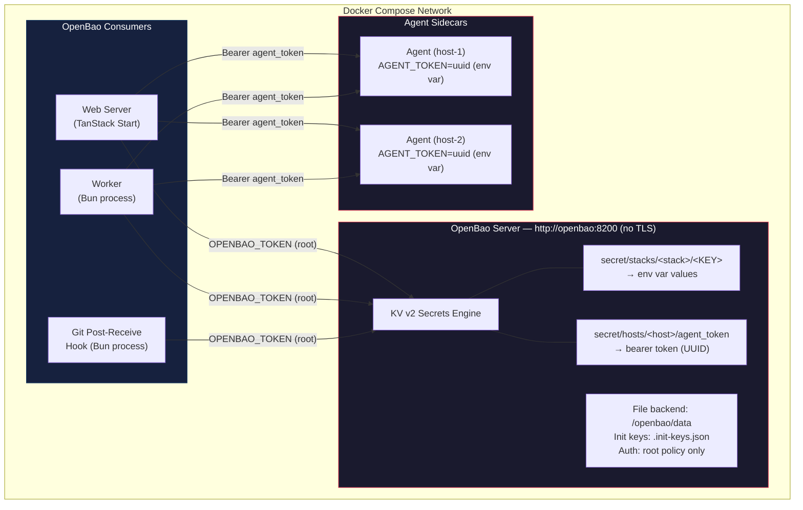
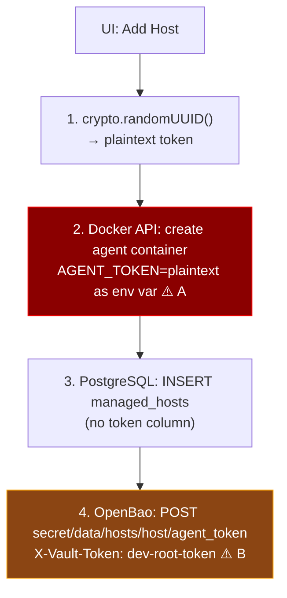
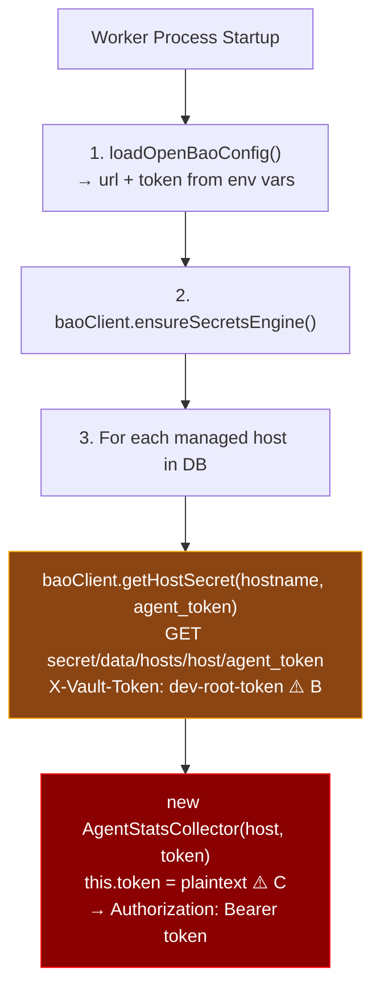
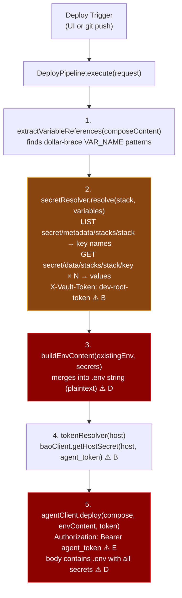
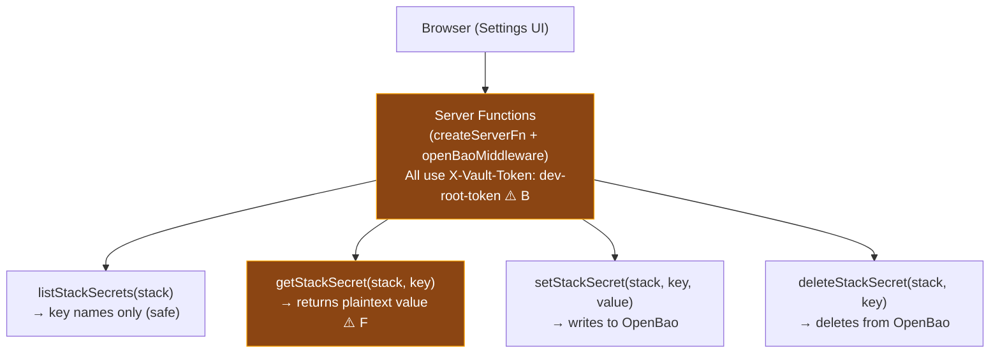
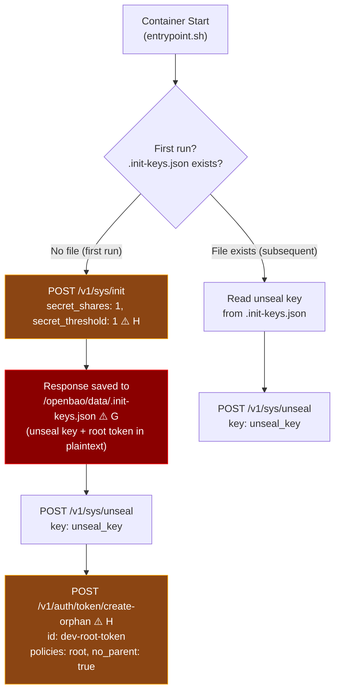
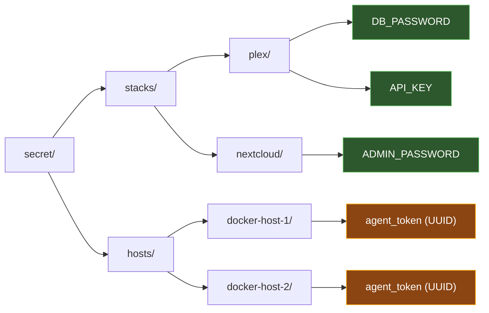
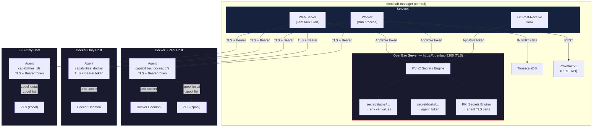
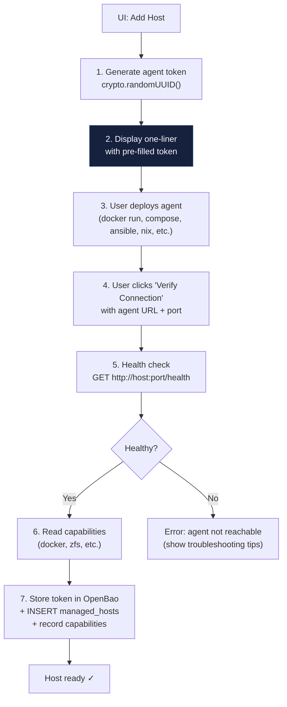
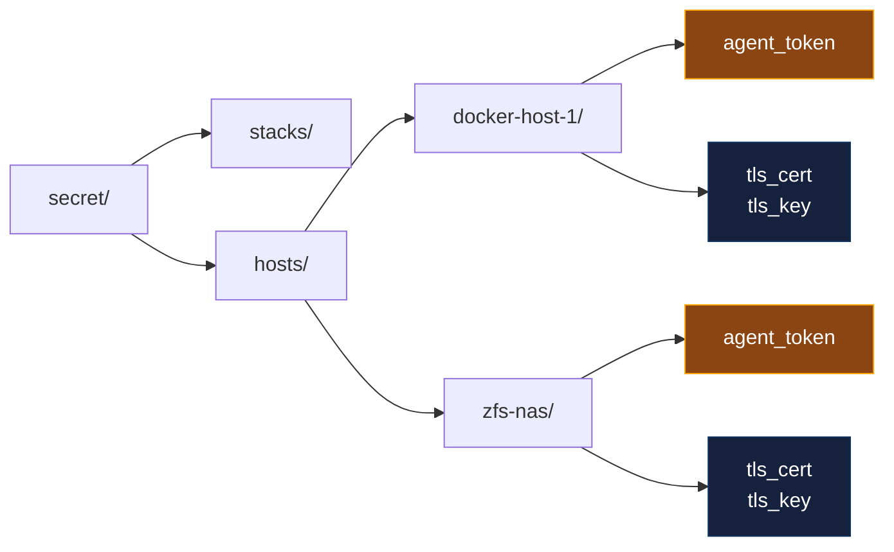

# OpenBao Architecture & Security Analysis

## Overview

OpenBao (open-source Vault fork) serves as the centralized secrets backend for homelab-manager. It stores two categories of secrets:

1. **Stack secrets** — environment variables injected into Docker Compose deployments
2. **Host tokens** — bearer tokens authenticating the web server/worker to agent sidecars

All services share a single root token to authenticate with OpenBao over unencrypted HTTP.

---

## High-Level Architecture



---

## Token & Secret Flows

### Flow 1: Agent Token Provisioning (addHost)



### Flow 2: Worker Reads Agent Token (startup)



### Flow 3: Deploy Pipeline (secret resolution)



### Flow 4: UI Secret Management



---

## OpenBao Initialization Sequence



---

## Security Findings & Risk Analysis

Each finding is tagged with the marker (e.g., `[A]`) from the flow diagrams above.

### CRITICAL

| # | Finding | Markers | Risk |
|---|---------|---------|------|
| 1 | **Root token shared across all services** | [B] | Web server, worker, and git hook all use the same `dev-root-token` with root policy. Compromise of any single process grants full OpenBao access (read/write/delete all secrets, manage auth, unseal). No blast-radius containment. |
| 2 | **No TLS on OpenBao listener** | [B] | `tls_disable = true` means all token and secret traffic is plaintext HTTP. Any process on the Docker network can sniff `X-Vault-Token` headers and secret values. ARP spoofing or container escape exposes everything. |
| 3 | **Init keys and root token stored in plaintext on disk** | [G] | `/openbao/data/.init-keys.json` contains the unseal key and original root token. Anyone with read access to the volume can unseal and authenticate. No file encryption, no key splitting. |
| 4 | **Agent tokens passed as container env vars** | [A] | `AGENT_TOKEN` is set as a Docker environment variable, visible via `docker inspect`, `/proc/1/environ`, and container orchestration APIs. Persists for the container lifetime. |

### HIGH

| # | Finding | Markers | Risk |
|---|---------|---------|------|
| 5 | **Agent tokens held in memory indefinitely** | [C] | `AgentStatsCollector` stores the plaintext token as an instance field for the worker's entire lifetime. Memory dump or debug endpoint could expose all agent tokens. |
| 6 | **Resolved secrets sent in plaintext to agent** | [D][E] | The deploy pipeline builds a `.env` string with all resolved secrets and sends it over HTTP to the agent. Network capture between web server and agent exposes every secret for that stack. |
| 7 | **No token rotation or expiry** | [A][C] | Agent tokens are static UUIDs with no TTL. Once generated, they're valid forever. Compromised token has unlimited use window. No rotation mechanism exists. |
| 8 | **Single Shamir share (1/1 threshold)** | [H] | Init uses `secret_shares:1, secret_threshold:1`, eliminating the security benefit of Shamir's Secret Sharing. One key unseals the vault. |

### MEDIUM

| # | Finding | Markers | Risk |
|---|---------|---------|------|
| 9 | **getStackSecret returns plaintext to browser** | [F] | The "reveal" UI calls a server function that returns the secret value over the wire to the browser. If the web server has XSS or the response is cached/logged, secrets leak. |
| 10 | **No audit logging** | all | OpenBao audit backend is not configured. No record of who read which secrets or when. Post-incident forensics impossible. |
| 11 | **No ACL policies** | [B] | All access uses root policy. Even if services got separate tokens, there's no policy restricting stacks/ vs hosts/ paths. The worker could modify stack secrets, the web server could delete host tokens, etc. |
| 12 | **File storage backend** | [G] | File backend provides no encryption at rest, no HA, and no replication. Disk access = full secret access. Production should use integrated storage (Raft). |

---

## Recommended Mitigations (Priority Order)

### Phase 1 — Network & Transport

1. **Enable TLS on OpenBao listener** — Generate certs (self-signed or internal CA) and set `tls_cert_file` / `tls_key_file`. All clients switch to HTTPS.
2. **Enable TLS for agent communication** — Agent sidecar should accept HTTPS connections; deploy pipeline and worker should verify certificates.

### Phase 2 — Authentication & Authorization

3. **Create per-service AppRole credentials** — Replace the shared root token with three AppRole logins:
   - `web-server` — read/write `secret/stacks/*`, read `secret/hosts/*/agent_token`
   - `worker` — read `secret/hosts/*/agent_token` only
   - `git-hook` — read `secret/stacks/*`, read `secret/hosts/*/agent_token`
4. **Scope policies with path restrictions** — Deny `sys/*` to all non-admin roles.
5. **Revoke the root token after setup** — Use `bao token revoke` post-init.

### Phase 3 — Token Lifecycle

6. **Implement agent token rotation** — Periodic re-generation with coordinated agent restart.
7. **Use short-lived tokens** — AppRole tokens with TTL + periodic renewal.
8. **Move agent tokens from env vars to mounted secrets** — Use Docker secrets or tmpfs-mounted files instead of environment variables.

### Phase 4 — Operational Security

9. **Enable audit logging** — `bao audit enable file file_path=/openbao/logs/audit.log` to capture all secret access.
10. **Increase Shamir shares** — Use at least 3 shares with threshold 2 for production.
11. **Encrypt init keys at rest** — Don't store `.init-keys.json` on the same volume as OpenBao data.
12. **Switch to Raft storage** — For encryption at rest, HA, and snapshot support.

---

## Secret Path Layout



---

## Component Credential Matrix

| Component | Credentials Held | How Obtained | Lifetime |
|-----------|-----------------|--------------|----------|
| Web Server | `OPENBAO_TOKEN` (root) | Environment variable | Process lifetime |
| Worker | `OPENBAO_TOKEN` (root), agent tokens (in memory) | Env var + OpenBao GET | Process lifetime |
| Git Hook | `OPENBAO_TOKEN` (root) | Environment variable | Per-invocation |
| Agent | `AGENT_TOKEN` (UUID) | Container env var | Container lifetime |
| OpenBao | Unseal key, root token | `.init-keys.json` on disk | Until revoked (never) |
| Deploy Pipeline | Stack secrets (in transit), agent token (in transit) | OpenBao GET → HTTP POST to agent | Request-scoped |
| Browser | Individual secret values (on reveal) | Server function response | Until page navigation |

---

## Target Architecture — Universal Agent (No Socket Proxy, No SSH)

### Motivation

The current architecture has three separate remote access patterns: the agent communicates with Docker via a socket proxy, ZFS stats are collected via SSH, and Proxmox uses its native REST API. The agent already enforces API restrictions through its explicit route definitions — making the socket proxy redundant. By expanding the agent into a **universal homelab sidecar** that also handles ZFS stats collection, we can eliminate both the socket proxy and all SSH infrastructure. The agent becomes the single authenticated entry point for all host-level operations.

Proxmox retains its direct REST API integration since it already provides a well-designed API with its own authentication.

### Current vs Target

```
CURRENT:
  Web Server ──HTTP──▶ Agent ──HTTP──▶ Socket Proxy ──▶ Docker Socket
  Worker ────HTTP──▶ Agent ──HTTP──▶ Socket Proxy ──▶ Docker Socket
  Worker ────SSH───▶ ZFS Host (zpool iostat, zpool list)
  Worker ────REST──▶ Proxmox API

TARGET:
  Web Server ──TLS──▶ Agent ──▶ Docker Socket (mounted)
  Worker ────TLS──▶ Agent ──▶ Docker stats + ZFS stats (local)
  Worker ────REST──▶ Proxmox API
```

### Target High-Level Architecture



### Key Changes

| Aspect | Current | Target |
|--------|---------|--------|
| Docker access | Agent → socket proxy (TCP) → Docker socket | Agent → Docker socket (mounted) |
| ZFS access | Worker → SSH → `zpool iostat` | Worker → Agent → `zpool iostat` (local) |
| Proxmox access | Worker → Proxmox REST API | *(unchanged)* |
| Transport | Plaintext HTTP + SSH | TLS (certs from OpenBao PKI) |
| Auth | Bearer token (agent) + SSH keys/passwords (ZFS) | TLS + Bearer token (agent only) |
| Socket proxy | Required per Docker host | **Removed** |
| SSH infrastructure | Required for ZFS hosts (`ssh2` library) | **Removed** |
| Agent scope | Docker-only sidecar | Universal sidecar (Docker + ZFS + future capabilities) |
| Agent deployment | Via socket proxy Dockerode | User-managed (one-liner or own automation) |
| Agent per host | One per Docker host | One per host (any host type) |

---

## Agent as Universal Sidecar

The agent evolves from a Docker-only sidecar into a universal homelab sidecar. One agent runs per host and exposes all local system data over its authenticated API. Capabilities are auto-detected and reported via the health endpoint.

### Feature Detection

The `/health` endpoint reports which capabilities are available on the host:

```json
{
  "version": "1.2.0",
  "capabilities": {
    "docker": { "available": true, "version": "24.0.9" },
    "zfs": { "available": true, "version": "2.2.2" }
  }
}
```

The agent detects capabilities at startup:
- **Docker**: Check if `/var/run/docker.sock` exists and is accessible
- **ZFS**: Check if `zpool` binary exists and is executable

The worker uses capabilities to decide which collectors to create for each agent. A host with only ZFS gets a `ZfsStatsCollector`; a host with both gets both collectors.

### Agent Endpoints (Target)

| Method | Path | Capability | Purpose |
|--------|------|------------|---------|
| GET | `/health` | *(always)* | Version, capabilities, heartbeat |
| GET | `/stats/stream` | docker | SSE container stats streaming |
| GET | `/logs/{containerId}` | docker | SSE container log streaming |
| POST | `/stacks/deploy` | docker | Run `docker compose up -d` |
| POST | `/stacks/teardown` | docker | Run `docker compose down` |
| POST | `/stacks/restart` | docker | Run `docker compose restart` |
| GET | `/stacks/status` | docker | List stacks in working directory |
| GET | `/stacks/events` | docker | SSE container lifecycle events |
| GET | `/zfs/stats/stream` | zfs | SSE `zpool iostat` streaming |
| GET | `/zfs/pools` | zfs | List pools with properties |

Endpoints for unavailable capabilities return `404` with a clear error (e.g., `{ "error": "ZFS is not available on this host" }`).

### What This Eliminates

| Removed Component | Replaced By |
|-------------------|-------------|
| `socket-proxy` container | Agent mounts Docker socket directly |
| `ssh2` library (worker) | Agent runs `zpool` commands locally |
| SSH connection manager | Agent HTTP client (already exists) |
| SSH middleware | *(removed)* |
| `ZFS_HOST_*` env vars | Managed hosts in DB (with `zfs` capability) |
| SSH credentials in OpenBao | *(not needed)* |
| Per-host SSH key management | *(not needed)* |

---

## Agent Deployment — User-Managed

The user is responsible for deploying and updating the agent on their hosts. This is the simplest and most honest approach for a homelab tool — users already have access to their machines and prefer to control what runs on them.

### Flow: Add Host



### One-Liner

The UI generates a token and displays a copy-pasteable command. The user runs it on their host using whatever method they prefer:

```bash
docker run -d \
  --name homelab-agent \
  --restart unless-stopped \
  -v /var/run/docker.sock:/var/run/docker.sock \
  -p 9090:9090 \
  -e AGENT_TOKEN=<generated-token> \
  ghcr.io/your-org/homelab-agent:latest
```

For hosts with ZFS but no Docker, the agent can run as a systemd service or any other process manager. A standalone binary or install script will be provided for non-Docker hosts.

### Agent Updates

Users update the agent themselves — pull the new image and restart the container. This can be automated with tools like Watchtower, or done manually:

```bash
docker pull ghcr.io/your-org/homelab-agent:latest
docker stop homelab-agent && docker rm homelab-agent
# re-run the original docker run command
```

The UI shows the current agent version (from `/health`) and whether a newer version is available, so users know when to update.

### Agent Container Changes

| Change | Before | After |
|--------|--------|-------|
| Docker access | `DOCKER_HOST=tcp://socket-proxy:2375` | `/var/run/docker.sock` mounted |
| ZFS access | *(not in agent)* | `zpool` binary available, pools accessible |
| `depends_on` | `socket-proxy` | *(none)* |
| Compose services | `socket-proxy` + `agent` | `agent` only |
| Deployment | Provisioned by homelab-manager via Dockerode | User-managed |

### Database Schema Changes

The `managed_hosts` table drops `socket_proxy_url` (no longer needed) and adds a capabilities column:

```sql
ALTER TABLE managed_hosts
  DROP COLUMN socket_proxy_url,
  ADD COLUMN capabilities JSONB DEFAULT '{}';  -- e.g. {"docker": true, "zfs": true}
```

No SSH fields needed — the user manages the agent lifecycle themselves.

### OpenBao Secret Path Updates

Simplified — no SSH credentials stored:



---

## Implementation Phases

### Phase 0 — Architecture Documentation (this PR)

Architecture diagrams and documentation updated to reflect the target state. No code changes yet.

### Phase 1 — Agent Direct Socket Access

1. Mount `/var/run/docker.sock` in agent container instead of `DOCKER_HOST=tcp://socket-proxy:2375`
2. Update agent Dockerfile to handle socket permissions (GID matching)
3. Remove socket-proxy service from docker-compose files
4. Drop `socket_proxy_url` from `managed_hosts` schema and all referencing code
5. Simplify `handleAddHost` to register-only flow (no provisioning via Dockerode)
6. UI: generate one-liner with pre-filled token, verify connection flow

### Phase 2 — Agent ZFS Support

1. Add `/zfs/stats/stream` endpoint — runs `zpool iostat` locally, streams via SSE
2. Add `/zfs/pools` endpoint — lists pools with properties
3. Add capability detection at startup (Docker socket exists? `zpool` binary exists?)
4. Update `/health` to report capabilities
5. Add `capabilities` JSONB column to `managed_hosts`
6. Worker: create collectors based on agent capabilities instead of `ZFS_HOST_*` env vars
7. Remove `ssh2` dependency from worker, remove SSH connection manager, remove SSH middleware

### Phase 3 — TLS for Agent Communication

1. Configure OpenBao PKI secrets engine as internal CA
2. Agent reads TLS cert/key from mounted files or OpenBao
3. Update `AgentClient` to use HTTPS with certificate verification
4. Update agent to serve HTTPS (Bun native TLS support)
5. Rotate certs automatically via OpenBao PKI TTL
