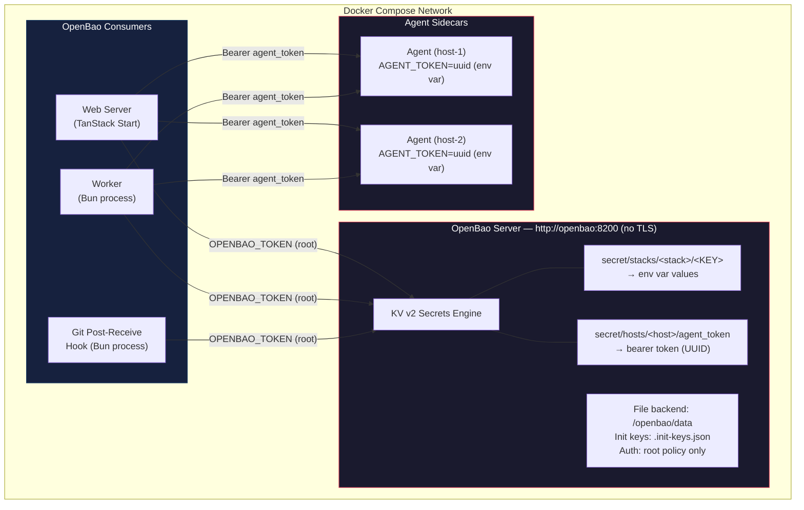
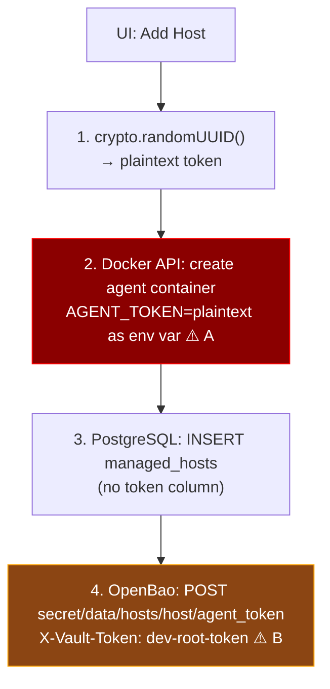
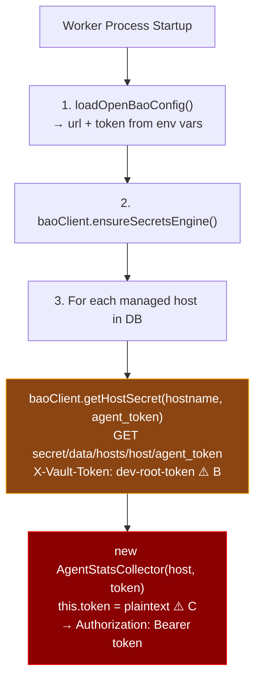
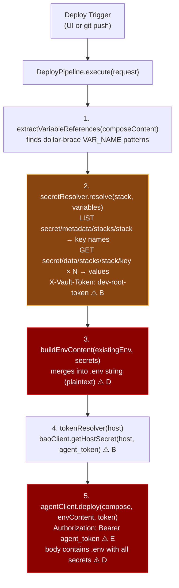
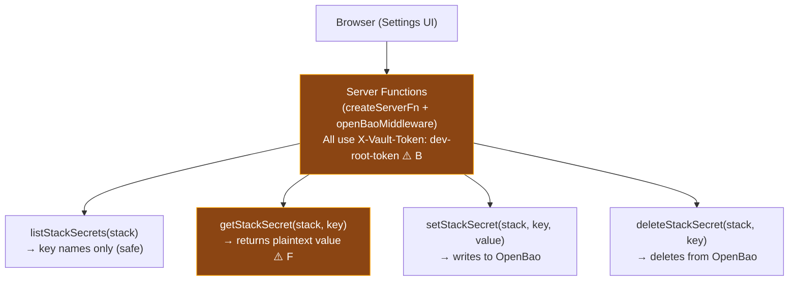
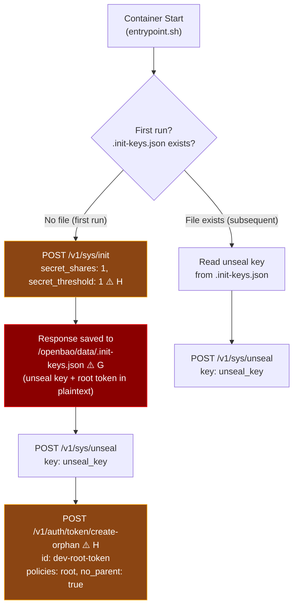
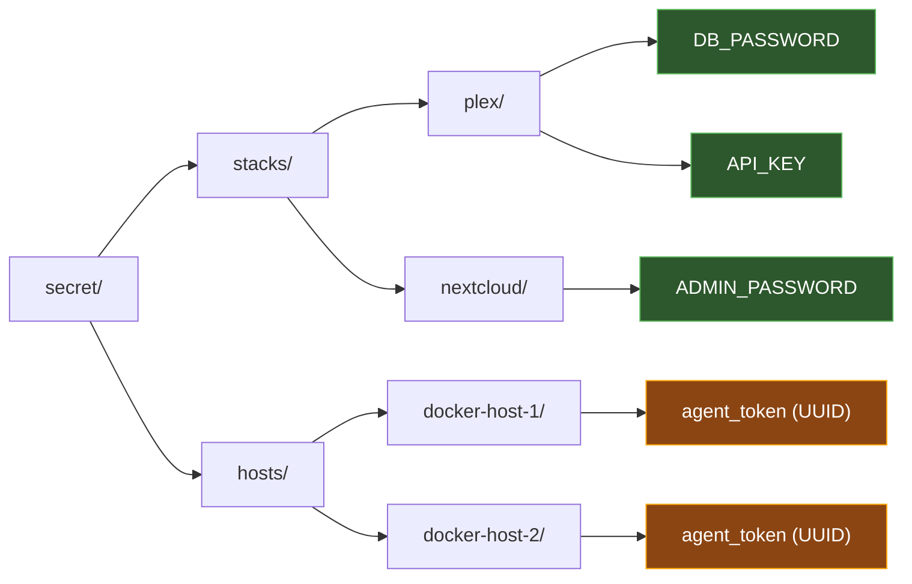
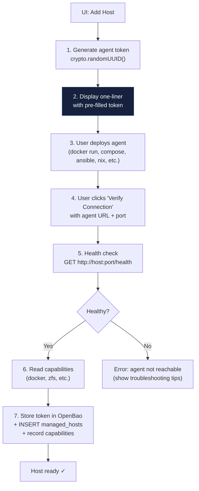
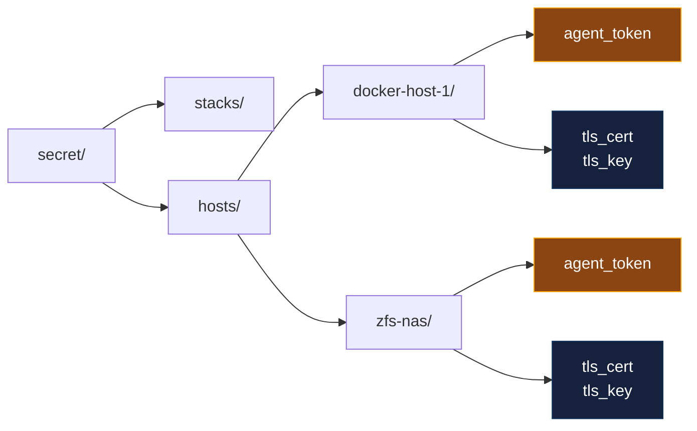

# OpenBao Architecture & Security Analysis

## Overview

OpenBao (open-source Vault fork) serves as the centralized secrets backend for homelab-manager. It stores two categories of secrets:

1. **Stack secrets** — environment variables injected into Docker Compose deployments
2. **Host tokens** — bearer tokens authenticating the web server/worker to agent sidecars

All services share a single root token to authenticate with OpenBao over unencrypted HTTP.

---

## High-Level Architecture



---

## Token & Secret Flows

### Flow 1: Agent Token Provisioning (addHost)



### Flow 2: Worker Reads Agent Token (startup)



### Flow 3: Deploy Pipeline (secret resolution)



### Flow 4: UI Secret Management



---

## OpenBao Initialization Sequence



---

## Security Findings & Risk Analysis

Each finding is tagged with the marker (e.g., `[A]`) from the flow diagrams above.

### CRITICAL

| # | Finding | Markers | Risk |
|---|---------|---------|------|
| 1 | **Root token shared across all services** | [B] | Web server, worker, and git hook all use the same `dev-root-token` with root policy. Compromise of any single process grants full OpenBao access (read/write/delete all secrets, manage auth, unseal). No blast-radius containment. |
| 2 | **No TLS on OpenBao listener** | [B] | `tls_disable = true` means all token and secret traffic is plaintext HTTP. Any process on the Docker network can sniff `X-Vault-Token` headers and secret values. ARP spoofing or container escape exposes everything. |
| 3 | **Init keys and root token stored in plaintext on disk** | [G] | `/openbao/data/.init-keys.json` contains the unseal key and original root token. Anyone with read access to the volume can unseal and authenticate. No file encryption, no key splitting. |
| 4 | **Agent tokens passed as container env vars** | [A] | `AGENT_TOKEN` is set as a Docker environment variable, visible via `docker inspect`, `/proc/1/environ`, and container orchestration APIs. Persists for the container lifetime. |

### HIGH

| # | Finding | Markers | Risk |
|---|---------|---------|------|
| 5 | **Agent tokens held in memory indefinitely** | [C] | `AgentStatsCollector` stores the plaintext token as an instance field for the worker's entire lifetime. Memory dump or debug endpoint could expose all agent tokens. |
| 6 | **Resolved secrets sent in plaintext to agent** | [D][E] | The deploy pipeline builds a `.env` string with all resolved secrets and sends it over HTTP to the agent. Network capture between web server and agent exposes every secret for that stack. |
| 7 | **No token rotation or expiry** | [A][C] | Agent tokens are static UUIDs with no TTL. Once generated, they're valid forever. Compromised token has unlimited use window. No rotation mechanism exists. |
| 8 | **Single Shamir share (1/1 threshold)** | [H] | Init uses `secret_shares:1, secret_threshold:1`, eliminating the security benefit of Shamir's Secret Sharing. One key unseals the vault. |

### MEDIUM

| # | Finding | Markers | Risk |
|---|---------|---------|------|
| 9 | **getStackSecret returns plaintext to browser** | [F] | The "reveal" UI calls a server function that returns the secret value over the wire to the browser. If the web server has XSS or the response is cached/logged, secrets leak. |
| 10 | **No audit logging** | all | OpenBao audit backend is not configured. No record of who read which secrets or when. Post-incident forensics impossible. |
| 11 | **No ACL policies** | [B] | All access uses root policy. Even if services got separate tokens, there's no policy restricting stacks/ vs hosts/ paths. The worker could modify stack secrets, the web server could delete host tokens, etc. |
| 12 | **File storage backend** | [G] | File backend provides no encryption at rest, no HA, and no replication. Disk access = full secret access. Production should use integrated storage (Raft). |

---

## Recommended Mitigations (Priority Order)

### Phase 1 — Network & Transport

1. **Enable TLS on OpenBao listener** — Generate certs (self-signed or internal CA) and set `tls_cert_file` / `tls_key_file`. All clients switch to HTTPS.
2. **Enable TLS for agent communication** — Agent sidecar should accept HTTPS connections; deploy pipeline and worker should verify certificates.

### Phase 2 — Authentication & Authorization

3. **Create per-service AppRole credentials** — Replace the shared root token with three AppRole logins:
   - `web-server` — read/write `secret/stacks/*`, read `secret/hosts/*/agent_token`
   - `worker` — read `secret/hosts/*/agent_token` only
   - `git-hook` — read `secret/stacks/*`, read `secret/hosts/*/agent_token`
4. **Scope policies with path restrictions** — Deny `sys/*` to all non-admin roles.
5. **Revoke the root token after setup** — Use `bao token revoke` post-init.

### Phase 3 — Token Lifecycle

6. **Implement agent token rotation** — Periodic re-generation with coordinated agent restart.
7. **Use short-lived tokens** — AppRole tokens with TTL + periodic renewal.
8. **Move agent tokens from env vars to mounted secrets** — Use Docker secrets or tmpfs-mounted files instead of environment variables.

### Phase 4 — Operational Security

9. **Enable audit logging** — `bao audit enable file file_path=/openbao/logs/audit.log` to capture all secret access.
10. **Increase Shamir shares** — Use at least 3 shares with threshold 2 for production.
11. **Encrypt init keys at rest** — Don't store `.init-keys.json` on the same volume as OpenBao data.
12. **Switch to Raft storage** — For encryption at rest, HA, and snapshot support.

---

## Secret Path Layout



---

## Component Credential Matrix

| Component | Credentials Held | How Obtained | Lifetime |
|-----------|-----------------|--------------|----------|
| Web Server | `OPENBAO_TOKEN` (root) | Environment variable | Process lifetime |
| Worker | `OPENBAO_TOKEN` (root), agent tokens (in memory) | Env var + OpenBao GET | Process lifetime |
| Git Hook | `OPENBAO_TOKEN` (root) | Environment variable | Per-invocation |
| Agent | `AGENT_TOKEN` (UUID) | Container env var | Container lifetime |
| OpenBao | Unseal key, root token | `.init-keys.json` on disk | Until revoked (never) |
| Deploy Pipeline | Stack secrets (in transit), agent token (in transit) | OpenBao GET → HTTP POST to agent | Request-scoped |
| Browser | Individual secret values (on reveal) | Server function response | Until page navigation |

---

## Target Architecture — Universal Agent (No Socket Proxy, No SSH)

### Motivation

The current architecture has three separate remote access patterns: the agent communicates with Docker via a socket proxy, ZFS stats are collected via SSH, and Proxmox uses its native REST API. By expanding the agent into a **universal homelab sidecar** that also handles ZFS stats collection, we can eliminate all SSH infrastructure. The agent becomes the single authenticated entry point for all host-level operations.

The socket proxy is **retained** as defense-in-depth — it restricts which Docker API endpoints are reachable even if the agent is compromised. The key change is that the socket proxy moves from being centrally managed to being **part of the agent stack** deployed on each host. The user deploys a single compose stack per host containing the agent, socket proxy, and an updater sidecar.

Proxmox retains its direct REST API integration since it already provides a well-designed API with its own authentication.

### Current vs Target

```
CURRENT:
  Web Server ──HTTP──▶ Agent ──HTTP──▶ Socket Proxy ──▶ Docker Socket
  Worker ────HTTP──▶ Agent ──HTTP──▶ Socket Proxy ──▶ Docker Socket
  Worker ────SSH───▶ ZFS Host (zpool iostat, zpool list)
  Worker ────REST──▶ Proxmox API

TARGET:
  Web Server ──TLS──▶ Agent ──TCP──▶ Socket Proxy ──▶ Docker Socket
  Worker ────TLS──▶ Agent ──TCP──▶ Socket Proxy ──▶ Docker Socket
  Worker ────TLS──▶ Agent ──▶ ZFS stats (local, via dedicated zfs user)
  Worker ────REST──▶ Proxmox API

  Each host runs an "agent stack" (docker-compose):
    ┌─────────────────────────────────────────┐
    │  Agent Stack (user-deployed)             │
    │  ┌───────────┐  ┌──────────────────┐    │
    │  │   Agent    │──│  Socket Proxy    │──▶ Docker Socket
    │  │ (port 9090)│  │ (internal only)  │    │
    │  └───────────┘  └──────────────────┘    │
    │  ┌──────────────────┐                    │
    │  │  Agent Updater    │ (watches for new  │
    │  │  (sidecar)        │  agent image tags) │
    │  └──────────────────┘                    │
    └─────────────────────────────────────────┘
```

### Target High-Level Architecture

```mermaid
graph TB
    subgraph homelab["homelab-manager (central)"]
        subgraph consumers["Services"]
            WEB["Web Server<br/>(TanStack Start)"]
            WORKER["Worker<br/>(Bun process)"]
            GIT["Git Post-Receive<br/>Hook"]
        end

        subgraph bao["OpenBao Server — https://openbao:8200 (TLS)"]
            KV["KV v2 Secrets Engine"]
            STACKS_S["secret/stacks/…<br/>→ env var values"]
            HOSTS_S["secret/hosts/…<br/>→ agent_token"]
            PKI["PKI Secrets Engine<br/>→ agent TLS certs"]
            KV --- STACKS_S
            KV --- HOSTS_S
            KV --- PKI
        end

        DB["TimescaleDB"]
        PROXMOX_API["Proxmox VE<br/>(REST API)"]

        WEB -->|"AppRole token"| KV
        WORKER -->|"AppRole token"| KV
        GIT -->|"AppRole token"| KV
        WORKER -->|"REST"| PROXMOX_API
        WORKER -->|"INSERT stats"| DB
    end

    subgraph host1["Docker + ZFS Host"]
        subgraph stack1["Agent Stack (docker-compose)"]
            A1["Agent<br/>capabilities: docker, zfs"]
            SP1["Socket Proxy<br/>(linuxserver)"]
            UP1["Updater<br/>(sidecar)"]
        end
        D1["Docker Daemon"]
        Z1["ZFS (zpool)<br/>via dedicated zfs user"]
        A1 -->|"TCP :2375"| SP1
        SP1 -->|"unix socket"| D1
        A1 -->|"zpool iostat<br/>zpool list"| Z1
        UP1 -.->|"watches image tags<br/>recreates agent"| A1
    end

    subgraph host2["Docker-Only Host"]
        subgraph stack2["Agent Stack (docker-compose)"]
            A2["Agent<br/>capabilities: docker"]
            SP2["Socket Proxy"]
            UP2["Updater"]
        end
        D2["Docker Daemon"]
        A2 -->|"TCP :2375"| SP2
        SP2 -->|"unix socket"| D2
        UP2 -.->|"watches"| A2
    end

    subgraph host3["ZFS-Only Host"]
        subgraph stack3["Agent Stack (docker-compose)"]
            A3["Agent<br/>capabilities: zfs"]
            UP3["Updater"]
        end
        Z3["ZFS (zpool)<br/>via dedicated zfs user"]
        A3 -->|"zpool iostat<br/>zpool list"| Z3
        UP3 -.->|"watches"| A3
    end

    WEB -->|"TLS + Bearer"| A1
    WEB -->|"TLS + Bearer"| A2
    WORKER -->|"TLS + Bearer"| A1
    WORKER -->|"TLS + Bearer"| A2
    WORKER -->|"TLS + Bearer"| A3

    style bao fill:#1a1a2e,stroke:#e94560,color:#fff
    style consumers fill:#16213e,stroke:#0f3460,color:#fff
    style stack1 fill:#0d1b2a,stroke:#1b9aaa,color:#fff
    style stack2 fill:#0d1b2a,stroke:#1b9aaa,color:#fff
    style stack3 fill:#0d1b2a,stroke:#1b9aaa,color:#fff
    style host1 fill:#1a1a2e,stroke:#0f3460,color:#fff
    style host2 fill:#1a1a2e,stroke:#0f3460,color:#fff
    style host3 fill:#1a1a2e,stroke:#0f3460,color:#fff
```



### Key Changes

| Aspect | Current | Target |
|--------|---------|--------|
| Docker access | Agent → socket proxy (TCP) → Docker socket | Agent → socket proxy (TCP) → Docker socket *(same path, user-deployed stack)* |
| ZFS access | Worker → SSH → `zpool iostat` | Worker → Agent → `zpool iostat` (local, dedicated `zfs` user) |
| Proxmox access | Worker → Proxmox REST API | *(unchanged)* |
| Transport | Plaintext HTTP + SSH | TLS (certs from OpenBao PKI) |
| Auth | Bearer token (agent) + SSH keys/passwords (ZFS) | TLS + Bearer token (agent only) |
| Socket proxy | Centrally managed per Docker host | **Part of agent stack** (user-deployed alongside agent) |
| SSH infrastructure | Required for ZFS hosts (`ssh2` library) | **Removed** |
| Agent scope | Docker-only sidecar | Universal sidecar (Docker + ZFS + future capabilities) |
| Agent deployment | Via socket proxy Dockerode | User-managed stack (compose file generated by UI) |
| Agent updates | Manual (user pulls new image) | **Updater sidecar** watches for new image tags, recreates agent |
| Agent per host | One per Docker host | One stack per host (agent + socket proxy + updater) |

---

## Agent as Universal Sidecar

The agent evolves from a Docker-only sidecar into a universal homelab sidecar. Each host runs an **agent stack** — a docker-compose file containing the agent, a socket proxy (for Docker hosts), and an updater sidecar. The UI generates the compose file with pre-filled configuration, and the user deploys it on the target host.

### Agent Stack

The agent stack is the unit of deployment. The UI generates a host-specific `docker-compose.yml` that the user copies and runs on the target host.

**Stack components:**

| Service | Purpose | When Included |
|---------|---------|---------------|
| `agent` | Universal sidecar — exposes authenticated API for Docker + ZFS operations | Always |
| `socket-proxy` | Restricts Docker API surface — agent connects via TCP instead of raw socket | Docker hosts only |
| `updater` | Watches for new agent image tags and recreates the agent container | Always |

The socket proxy provides defense-in-depth: even if the agent is compromised, the attacker only has access to the Docker API endpoints explicitly allowed by the socket proxy configuration. The agent never mounts the Docker socket directly.

The updater sidecar is a lightweight container that periodically checks GHCR for new agent image tags. When a new version is found, it pulls the image and recreates the agent container. The updater needs the Docker socket mounted to manage sibling containers. See [Reference Agent Stack](#reference-agent-stack) for the compose file.

### Feature Detection

The `/health` endpoint reports which capabilities are available on the host:

```json
{
  "version": "1.2.0",
  "capabilities": {
    "docker": { "available": true, "version": "24.0.9" },
    "zfs": { "available": true, "version": "2.2.2" }
  }
}
```

The agent detects capabilities at startup:
- **Docker**: Check if the socket proxy is reachable at `DOCKER_HOST` (TCP)
- **ZFS**: Check if `zpool` binary exists and is executable

The worker uses capabilities to decide which collectors to create for each agent. A host with only ZFS gets a `ZfsStatsCollector`; a host with both gets both collectors.

### Agent Endpoints (Target)

| Method | Path | Capability | Purpose |
|--------|------|------------|---------|
| GET | `/health` | *(always)* | Version, capabilities, heartbeat |
| GET | `/stats/stream` | docker | SSE container stats streaming |
| GET | `/logs/{containerId}` | docker | SSE container log streaming |
| POST | `/stacks/deploy` | docker | Run `docker compose up -d` |
| POST | `/stacks/teardown` | docker | Run `docker compose down` |
| POST | `/stacks/restart` | docker | Run `docker compose restart` |
| GET | `/stacks/status` | docker | List stacks in working directory |
| GET | `/stacks/events` | docker | SSE container lifecycle events |
| GET | `/zfs/stats/stream` | zfs | SSE `zpool iostat` streaming |
| GET | `/zfs/pools` | zfs | List pools with properties |

Endpoints for unavailable capabilities return `404` with a clear error (e.g., `{ "error": "ZFS is not available on this host" }`).

### Reference Agent Stack

The UI generates a compose file tailored to the host's capabilities. Below is the reference for a Docker + ZFS host. Docker-only hosts omit the ZFS volume mounts; ZFS-only hosts omit the socket-proxy service.

```yaml
# homelab-manager agent stack
# Generated by homelab-manager UI — deploy on target host
# Usage: docker compose up -d

services:
  socket-proxy:
    image: lscr.io/linuxserver/socket-proxy:latest
    container_name: hlm-socket-proxy
    restart: unless-stopped
    volumes:
      - /var/run/docker.sock:/var/run/docker.sock:ro
    environment:
      # Read-only monitoring
      CONTAINERS: 1
      EVENTS: 1
      INFO: 1
      IMAGES: 1
      NETWORKS: 1
      VOLUMES: 1
      VERSION: 1
      # Management (if Docker management is enabled)
      ALLOW_START: 1
      ALLOW_STOP: 1
      ALLOW_RESTARTS: 1
      POST: 1
      # Stacks/compose operations
      EXEC: 1
      CONTAINERS_CREATE: 1
      CONTAINERS_DELETE: 1
    networks:
      - agent-internal
    # Not exposed to host network — only agent can reach it

  agent:
    image: ghcr.io/your-org/homelab-manager-agent:latest
    container_name: hlm-agent
    restart: unless-stopped
    ports:
      - "${HLM_AGENT_PORT:-9090}:9090"
    environment:
      AGENT_TOKEN: "${HLM_AGENT_TOKEN}"
      DOCKER_HOST: "tcp://socket-proxy:2375"
      # ZFS: agent runs commands as the dedicated hlm-zfs user
      # Requires host user setup — see docs
    volumes:
      # ZFS: mount zpool/zfs binaries and /dev/zfs device
      - /usr/sbin/zpool:/usr/sbin/zpool:ro
      - /usr/sbin/zfs:/usr/sbin/zfs:ro
      - /dev/zfs:/dev/zfs
    networks:
      - agent-internal
    depends_on:
      - socket-proxy
    labels:
      - "hlm.managed=true"
      - "hlm.role=agent"

  updater:
    image: ghcr.io/your-org/homelab-manager-updater:latest
    container_name: hlm-updater
    restart: unless-stopped
    volumes:
      - /var/run/docker.sock:/var/run/docker.sock
    environment:
      # Which container to watch and update
      HLM_WATCH_CONTAINER: hlm-agent
      HLM_WATCH_IMAGE: ghcr.io/your-org/homelab-manager-agent
      # Check interval (default: 6 hours)
      HLM_CHECK_INTERVAL: "${HLM_CHECK_INTERVAL:-6h}"
    labels:
      - "hlm.managed=true"
      - "hlm.role=updater"

networks:
  agent-internal:
    driver: bridge
    internal: true  # No external access — isolates socket proxy
```

**Key design decisions:**

- `agent-internal` network is marked `internal: true` — the socket proxy has no host port binding and is only reachable by the agent within the stack.
- The updater mounts the Docker socket directly because it needs to pull images and recreate sibling containers. This is the only container with raw socket access.
- ZFS binary mounts (`/usr/sbin/zpool`, `/dev/zfs`) are only included for hosts with ZFS. The UI omits these for Docker-only hosts.
- The agent token is passed via environment variable. In Phase 3 (TLS), this moves to a mounted file.

### Updater Sidecar

The updater is a minimal container (~5MB) that:

1. Periodically checks GHCR for new tags matching the agent image
2. Compares the remote digest with the running container's image digest
3. If different: pulls the new image, stops the agent, recreates it with the same configuration
4. Reports update status to the agent's `/health` endpoint (agent exposes last-updated timestamp)

The updater does **not** auto-update itself — it's small enough that manual updates are infrequent. The UI shows the updater version alongside the agent version and warns if either is outdated.

**Why not Watchtower?** Watchtower is a general-purpose updater that watches all containers. We want something scoped to only the agent container, with awareness of the homelab-manager ecosystem (version compatibility checks, health verification after update). The updater can verify the new agent is healthy before considering the update successful, and roll back if the health check fails.

### ZFS User Setup

The agent should not run ZFS commands as root. Instead, create a dedicated user with minimum ZFS permissions on the host.

#### Creating the `hlm-zfs` User

```bash
# Create a system user with no home directory and no login shell
sudo useradd --system --no-create-home --shell /usr/sbin/nologin hlm-zfs

# Add the user to the 'zfs' group (gives access to /dev/zfs)
# On some distros this group doesn't exist — create it if needed
sudo groupadd -f zfs
sudo usermod -aG zfs hlm-zfs
```

#### Granting ZFS Permissions

ZFS supports **delegated permissions** that grant specific operations to non-root users without giving full admin access.

```bash
# Grant read-only stats permissions on all pools
# This is the minimum needed for monitoring
for pool in $(zpool list -Ho name); do
  sudo zfs allow hlm-zfs send,hold,snapshot,mount,userprop "$pool"
  sudo zpool set delegation=on "$pool"
done

# Verify permissions
zfs allow <pool-name>
```

**Required ZFS permissions by agent endpoint:**

| Endpoint | ZFS Operations | Permissions Needed |
|----------|---------------|--------------------|
| `/zfs/stats/stream` | `zpool iostat` | Read access to `/dev/zfs` (via `zfs` group membership) |
| `/zfs/pools` | `zpool list`, `zpool status` | Read access to `/dev/zfs` (via `zfs` group membership) |

For monitoring-only use, group membership in `zfs` is sufficient — no delegated permissions needed. The delegated permissions above are only required if future agent features need dataset-level operations (snapshots, sends, etc.).

#### Configuring the Agent Container

The agent container runs as the `hlm-zfs` user's UID/GID:

```yaml
# In the agent stack compose file
agent:
  # ...
  user: "${HLM_ZFS_UID}:${HLM_ZFS_GID}"
  group_add:
    - "${DOCKER_GID}"  # For socket-proxy access (if Docker host)
```

The `.env` file alongside the stack compose:

```bash
# Run: id hlm-zfs
HLM_ZFS_UID=996
HLM_ZFS_GID=996
# Run: getent group docker | cut -d: -f3
DOCKER_GID=999
```

#### Distro-Specific Notes

| Distro | ZFS Group | Notes |
|--------|-----------|-------|
| Ubuntu / Debian | `zfs` group may not exist | Create with `groupadd zfs`, then `chgrp zfs /dev/zfs && chmod g+rw /dev/zfs`. Add udev rule for persistence. |
| Proxmox VE | `/dev/zfs` owned by `root:root` | Same as Ubuntu — create group and udev rule. |
| TrueNAS SCALE | ZFS permissions differ | TrueNAS manages ZFS — use its API instead of an agent. |
| Arch Linux | `zfs` group typically exists | Verify with `ls -la /dev/zfs`. |

**Udev rule for persistent `/dev/zfs` permissions** (Ubuntu/Debian/Proxmox):

```bash
echo 'KERNEL=="zfs", GROUP="zfs", MODE="0660"' | sudo tee /etc/udev/rules.d/90-zfs-permissions.rules
sudo udevadm control --reload-rules
sudo udevadm trigger
```

### What This Eliminates

| Removed Component | Replaced By |
|-------------------|-------------|
| `socket-proxy` container | Agent mounts Docker socket directly |
| `ssh2` library (worker) | Agent runs `zpool` commands locally |
| SSH connection manager | Agent HTTP client (already exists) |
| SSH middleware | *(removed)* |
| `ZFS_HOST_*` env vars | Managed hosts in DB (with `zfs` capability) |
| SSH credentials in OpenBao | *(not needed)* |
| Per-host SSH key management | *(not needed)* |

---

## Agent Deployment — User-Managed

The user is responsible for deploying and updating the agent on their hosts. This is the simplest and most honest approach for a homelab tool — users already have access to their machines and prefer to control what runs on them.

### Flow: Add Host



### One-Liner

The UI generates a token and displays a copy-pasteable command. The user runs it on their host using whatever method they prefer:

```bash
docker run -d \
  --name homelab-agent \
  --restart unless-stopped \
  -v /var/run/docker.sock:/var/run/docker.sock \
  -p 9090:9090 \
  -e AGENT_TOKEN=<generated-token> \
  ghcr.io/your-org/homelab-agent:latest
```

For hosts with ZFS but no Docker, the agent can run as a systemd service or any other process manager. A standalone binary or install script will be provided for non-Docker hosts.

### Agent Updates

Users update the agent themselves — pull the new image and restart the container. This can be automated with tools like Watchtower, or done manually:

```bash
docker pull ghcr.io/your-org/homelab-agent:latest
docker stop homelab-agent && docker rm homelab-agent
# re-run the original docker run command
```

The UI shows the current agent version (from `/health`) and whether a newer version is available, so users know when to update.

### Agent Container Changes

| Change | Before | After |
|--------|--------|-------|
| Docker access | `DOCKER_HOST=tcp://socket-proxy:2375` | `/var/run/docker.sock` mounted |
| ZFS access | *(not in agent)* | `zpool` binary available, pools accessible |
| `depends_on` | `socket-proxy` | *(none)* |
| Compose services | `socket-proxy` + `agent` | `agent` only |
| Deployment | Provisioned by homelab-manager via Dockerode | User-managed |

### Database Schema Changes

The `managed_hosts` table drops `socket_proxy_url` (no longer needed) and adds a capabilities column:

```sql
ALTER TABLE managed_hosts
  DROP COLUMN socket_proxy_url,
  ADD COLUMN capabilities JSONB DEFAULT '{}';  -- e.g. {"docker": true, "zfs": true}
```

No SSH fields needed — the user manages the agent lifecycle themselves.

### OpenBao Secret Path Updates

Simplified — no SSH credentials stored:



---

## Implementation Phases

### Phase 0 — Architecture Documentation (this PR)

Architecture diagrams and documentation updated to reflect the target state. No code changes yet.

### Phase 1 — Agent Stack & User-Managed Deployment

1. Create reference agent stack compose file (agent + socket proxy + updater)
2. Agent connects to socket proxy via `DOCKER_HOST=tcp://socket-proxy:2375` (same as today, but stack-local)
3. Build updater sidecar — lightweight container that watches GHCR for new agent image tags and recreates the agent
4. Drop `socket_proxy_url` from `managed_hosts` schema (socket proxy is now internal to the stack)
5. Simplify `handleAddHost` to register-only flow (no provisioning via Dockerode)
6. UI: generate host-specific compose file with pre-filled token, show copy-paste instructions
7. UI: verify agent connection after user deploys the stack

### Phase 2 — Agent ZFS Support

1. Add `/zfs/stats/stream` endpoint — runs `zpool iostat` locally, streams via SSE
2. Add `/zfs/pools` endpoint — lists pools with properties
3. Add capability detection at startup (socket proxy reachable? `zpool` binary exists?)
4. Update `/health` to report capabilities
5. Add `capabilities` JSONB column to `managed_hosts`
6. Worker: create collectors based on agent capabilities instead of `ZFS_HOST_*` env vars
7. Remove `ssh2` dependency from worker, remove SSH connection manager, remove SSH middleware
8. Document ZFS user setup — create dedicated `hlm-zfs` user with minimum permissions (see [ZFS User Setup](#zfs-user-setup))
9. Agent runs ZFS commands as the dedicated user (not root)

### Phase 3 — TLS for Agent Communication

1. Configure OpenBao PKI secrets engine as internal CA
2. Agent reads TLS cert/key from mounted files or OpenBao
3. Update `AgentClient` to use HTTPS with certificate verification
4. Update agent to serve HTTPS (Bun native TLS support)
5. Rotate certs automatically via OpenBao PKI TTL

---

## Documentation Updates Required

Tracking all files that need updates when the universal agent architecture is implemented.

### Files to Delete

| File | Reason |
|------|--------|
| `src/lib/clients/ssh-client.ts` | SSH replaced by agent |
| `src/middleware/ssh-middleware.ts` | SSH replaced by agent |

### Documentation to Rewrite

| File | What Changes |
|------|-------------|
| `self-hosting/README.md` | "Docker Monitoring" section (lines 96–134): replace centrally-managed socket-proxy setup with agent stack deployment instructions. "ZFS Monitoring" section (lines 136–155): remove SSH key setup, replace with agent stack + ZFS user setup instructions. |
| `docs/development.md` | Update local dev instructions — socket proxy moves from central compose to agent stack. Update references to new deployment model. |
| `README.md` | Line 34: "ZFS Dashboard - ... via SSH" → update to agent-based description. |
| `.env.example` | Lines 25–27: update socket-proxy references (now part of agent stack, not central). Lines 31–38: remove/deprecate `ZFS_HOST_*` env vars. Lines 60–61: update management profile comment. |

### Docker Compose Files

| File | What Changes |
|------|-------------|
| `docker-compose.local.yml` | Remove central socket-proxy service (lines 99–117). Agent stack runs its own. |
| `docker-compose.agent.yml` | Remove socket-proxy service (lines 4–44) — it's now part of the agent stack deployed on target hosts. Remove Dockerode-based provisioning deps. Agent stack is user-deployed. |
| `docker-compose.dev.yml` | Remove/deprecate `ZFS_HOST_*` env var template (lines 28–49). |
| `docker-compose.yml` | Remove/deprecate `ZFS_HOST_*` env var definitions (lines 20–41). |

### New Files

| File | Purpose |
|------|---------|
| Agent stack template | Compose file template used by UI to generate host-specific stacks. See [Reference Agent Stack](#reference-agent-stack). |
| Updater sidecar | New container image — minimal binary that watches GHCR for agent image updates. |
| ZFS setup script | Optional helper script for ZFS user creation + udev rule. Referenced from UI. |

### Source Code

| File | What Changes |
|------|-------------|
| `src/lib/config/zfs-config.ts` | Remove SSH credential fields from schema. May be replaced entirely if ZFS hosts move to managed_hosts DB table. |
| `src/worker/collectors/zfs-collector.ts` | Refactor to call agent `/zfs/stats/stream` instead of SSH. May merge into `agent-stats-collector.ts`. |
| `src/worker/collector-factory.ts` | Lines 62–81: refactor ZFS collector creation to use agent capabilities instead of `ZFS_HOST_*` env vars. |
| `src/lib/services/agent-provisioning-service.ts` | Remove Dockerode-based provisioning. Replace with compose file generation for user-managed deployment. |
| `src/lib/services/agent-update-service.ts` | Remove Dockerode-based update. Updates handled by updater sidecar. May keep version-check logic for UI warnings. |
| `src/data/hosts.functions.tsx` | Remove `socketProxyUrl` from schemas and handlers. Replace provisioning flow with compose file generation + register + health-check flow. |
| `src/lib/hosts/host-utils.ts` | Remove `socket_proxy_url` from type definitions and utility functions. |
| `src/lib/database/repositories/host-repository.ts` | Remove `socket_proxy_url` column references. Add `capabilities` JSONB column. |
| `src/lib/clients/agent-client.ts` | Add ZFS endpoint methods. Add TLS support (Phase 3). |
| `agent/src/index.ts` | Add ZFS route handlers. Add capability detection. Update `/health` response. |

### Database Migration

```sql
-- Migration: Remove socket_proxy_url, add capabilities
ALTER TABLE managed_hosts
  DROP COLUMN socket_proxy_url,
  ADD COLUMN capabilities JSONB DEFAULT '{}';
```

### Security Considerations

See [Security Analysis — Post-Migration](#security-analysis--post-migration) below.

---

## Security Analysis — Post-Migration

### Resolved by Universal Agent

| # | Original Finding | Resolution |
|---|-----------------|------------|
| 4 | Agent tokens passed as container env vars | Still applies — agent token is still an env var in the container. Mitigated in Phase 3 by mounting tokens from files instead. |
| 6 | Resolved secrets sent in plaintext to agent | Mitigated by TLS in Phase 3. Agent communication encrypted end-to-end. |

### New Considerations

| # | Concern | Risk | Mitigation |
|---|---------|------|------------|
| N1 | **Socket proxy in agent stack** | Socket proxy restricts Docker API surface, but the updater sidecar still needs raw socket access to manage sibling containers. | Socket proxy is on an `internal: true` network — not reachable from outside the stack. Updater is minimal code (~5MB image) with a narrow scope. Only the updater mounts the Docker socket; the agent never does. |
| N2 | **Agent runs ZFS commands** | `zpool` commands need access to `/dev/zfs`. The agent could potentially run destructive ZFS operations. | Agent runs as a dedicated `hlm-zfs` user with read-only `/dev/zfs` access via group membership. No delegated write permissions granted. Agent code only executes `zpool iostat` and `zpool list` — no destructive commands. See [ZFS User Setup](#zfs-user-setup). |
| N3 | **Agent update lifecycle** | Users may run outdated agent versions with known vulnerabilities. | Updater sidecar automatically pulls new agent images and recreates the container. UI shows version warnings for outdated agents and updaters. Web server does **not** refuse connections from old agents — this is a homelab app, availability matters more than enforcing upgrades. Updater verifies health after update and rolls back on failure. |
| N4 | **Agent token displayed in UI** | The compose file generation flow shows the plaintext token in the browser. | Token is embedded in the generated compose file, shown once. Token can be regenerated if compromised (requires stack redeploy with new token). |
| N5 | **Single agent = single point of failure per host** | If the agent stack goes down, all monitoring and management for that host stops. | All stack services use `restart: unless-stopped`. Updater can restart failed agent containers. Health checks detect failures and show status in UI. Acceptable for homelab use. |
| N6 | **Agent capability expansion increases attack surface** | Adding ZFS support means the agent binary has more code paths and system access. | Keep capability modules isolated. ZFS routes only load if `zpool` binary is accessible. Agent runs as non-root with minimum permissions per capability. Socket proxy constrains Docker access. |
| N7 | **Updater has raw Docker socket access** | The updater container mounts `/var/run/docker.sock` to manage sibling containers. A compromised updater has full Docker daemon access. | Updater is a minimal, single-purpose binary with no network exposure (no ports, no API). It only interacts with the Docker socket to pull images and recreate the agent container. Small codebase makes it auditable. |

### Unchanged Findings

The following findings from the original security analysis remain unchanged and are addressed by the existing mitigation phases:

- **[1] Root token shared across all services** → Phase 2 (AppRole credentials)
- **[2] No TLS on OpenBao listener** → Phase 1 (enable TLS)
- **[3] Init keys in plaintext on disk** → Phase 4 (encrypt at rest)
- **[5] Agent tokens held in memory indefinitely** → Phase 3 (short-lived tokens)
- **[7] No token rotation** → Phase 3 (token lifecycle)
- **[8] Single Shamir share** → Phase 4 (increase shares)
- **[9–12] Audit, ACL, storage** → Phase 2/4 (operational security)
