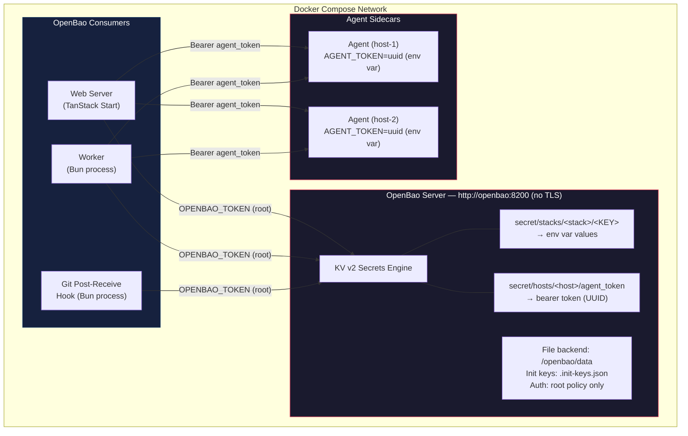
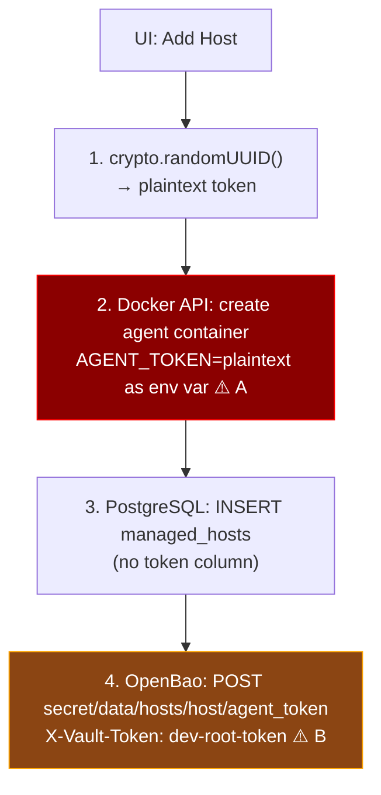
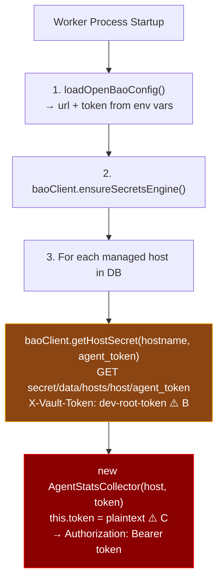
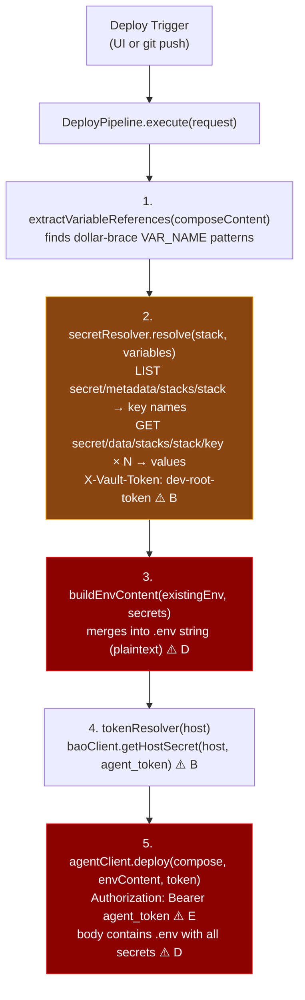
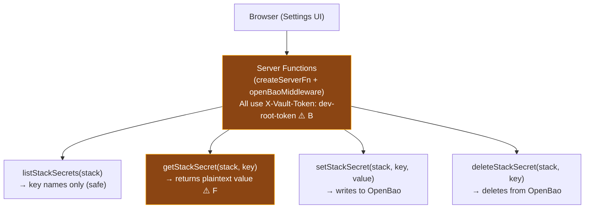
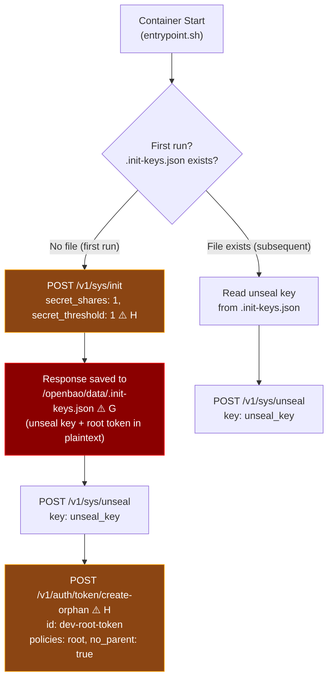
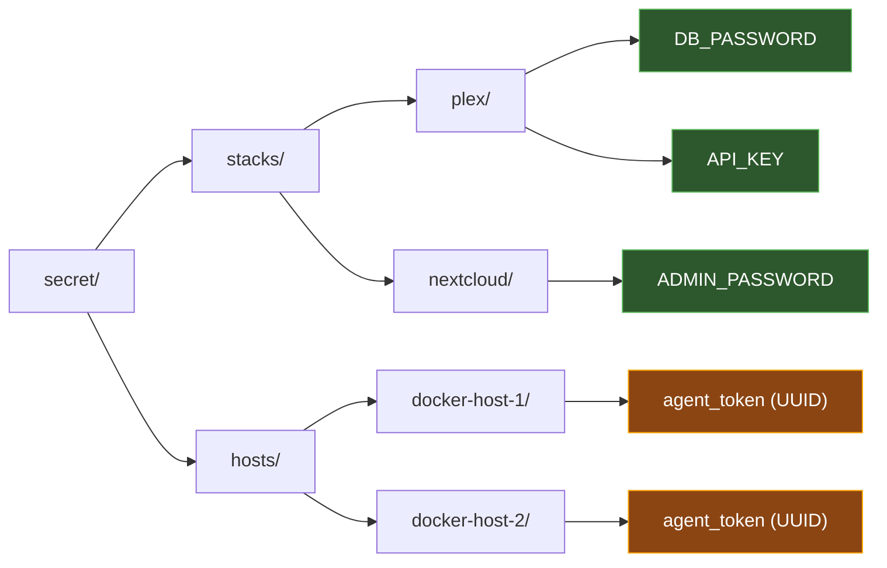

# OpenBao Architecture & Security Analysis

## Overview

OpenBao (open-source Vault fork) serves as the centralized secrets backend for homelab-manager. It stores two categories of secrets:

1. **Stack secrets** — environment variables injected into Docker Compose deployments
2. **Host tokens** — bearer tokens authenticating the web server/worker to agent sidecars

All services share a single root token to authenticate with OpenBao over unencrypted HTTP.

---

## High-Level Architecture

---

## Token & Secret Flows

### Flow 1: Agent Token Provisioning (addHost)

### Flow 2: Worker Reads Agent Token (startup)

### Flow 3: Deploy Pipeline (secret resolution)

### Flow 4: UI Secret Management

---

## OpenBao Initialization Sequence

---

## Security Findings & Risk Analysis

Each finding is tagged with the marker (e.g., `[A]`) from the flow diagrams above.

### CRITICAL

| # | Finding | Markers | Risk |
|---|---------|---------|------|
| 1 | **Root token shared across all services** | [B] | Web server, worker, and git hook all use the same `dev-root-token` with root policy. Compromise of any single process grants full OpenBao access (read/write/delete all secrets, manage auth, unseal). No blast-radius containment. |
| 2 | **No TLS on OpenBao listener** | [B] | `tls_disable = true` means all token and secret traffic is plaintext HTTP. Any process on the Docker network can sniff `X-Vault-Token` headers and secret values. ARP spoofing or container escape exposes everything. |
| 3 | **Init keys and root token stored in plaintext on disk** | [G] | `/openbao/data/.init-keys.json` contains the unseal key and original root token. Anyone with read access to the volume can unseal and authenticate. No file encryption, no key splitting. |
| 4 | **Agent tokens passed as container env vars** | [A] | `AGENT_TOKEN` is set as a Docker environment variable, visible via `docker inspect`, `/proc/1/environ`, and container orchestration APIs. Persists for the container lifetime. |

### HIGH

| # | Finding | Markers | Risk |
|---|---------|---------|------|
| 5 | **Agent tokens held in memory indefinitely** | [C] | `AgentStatsCollector` stores the plaintext token as an instance field for the worker's entire lifetime. Memory dump or debug endpoint could expose all agent tokens. |
| 6 | **Resolved secrets sent in plaintext to agent** | [D][E] | The deploy pipeline builds a `.env` string with all resolved secrets and sends it over HTTP to the agent. Network capture between web server and agent exposes every secret for that stack. |
| 7 | **No token rotation or expiry** | [A][C] | Agent tokens are static UUIDs with no TTL. Once generated, they're valid forever. Compromised token has unlimited use window. No rotation mechanism exists. |
| 8 | **Single Shamir share (1/1 threshold)** | [H] | Init uses `secret_shares:1, secret_threshold:1`, eliminating the security benefit of Shamir's Secret Sharing. One key unseals the vault. |

### MEDIUM

| # | Finding | Markers | Risk |
|---|---------|---------|------|
| 9 | **getStackSecret returns plaintext to browser** | [F] | The "reveal" UI calls a server function that returns the secret value over the wire to the browser. If the web server has XSS or the response is cached/logged, secrets leak. |
| 10 | **No audit logging** | all | OpenBao audit backend is not configured. No record of who read which secrets or when. Post-incident forensics impossible. |
| 11 | **No ACL policies** | [B] | All access uses root policy. Even if services got separate tokens, there's no policy restricting stacks/ vs hosts/ paths. The worker could modify stack secrets, the web server could delete host tokens, etc. |
| 12 | **File storage backend** | [G] | File backend provides no encryption at rest, no HA, and no replication. Disk access = full secret access. Production should use integrated storage (Raft). |

---

## Recommended Mitigations (Priority Order)

### Phase 1 — Network & Transport

1. **Enable TLS on OpenBao listener** — Generate certs (self-signed or internal CA) and set `tls_cert_file` / `tls_key_file`. All clients switch to HTTPS.
2. **Enable TLS for agent communication** — Agent sidecar should accept HTTPS connections; deploy pipeline and worker should verify certificates.

### Phase 2 — Authentication & Authorization

3. **Create per-service AppRole credentials** — Replace the shared root token with three AppRole logins:
   - `web-server` — read/write `secret/stacks/*`, read `secret/hosts/*/agent_token`
   - `worker` — read `secret/hosts/*/agent_token` only
   - `git-hook` — read `secret/stacks/*`, read `secret/hosts/*/agent_token`
4. **Scope policies with path restrictions** — Deny `sys/*` to all non-admin roles.
5. **Revoke the root token after setup** — Use `bao token revoke` post-init.

### Phase 3 — Token Lifecycle

6. **Implement agent token rotation** — Periodic re-generation with coordinated agent restart.
7. **Use short-lived tokens** — AppRole tokens with TTL + periodic renewal.
8. **Move agent tokens from env vars to mounted secrets** — Use Docker secrets or tmpfs-mounted files instead of environment variables.

### Phase 4 — Operational Security

9. **Enable audit logging** — `bao audit enable file file_path=/openbao/logs/audit.log` to capture all secret access.
10. **Increase Shamir shares** — Use at least 3 shares with threshold 2 for production.
11. **Encrypt init keys at rest** — Don't store `.init-keys.json` on the same volume as OpenBao data.
12. **Switch to Raft storage** — For encryption at rest, HA, and snapshot support.

---

## Secret Path Layout

---

## Component Credential Matrix

| Component | Credentials Held | How Obtained | Lifetime |
|-----------|-----------------|--------------|----------|
| Web Server | `OPENBAO_TOKEN` (root) | Environment variable | Process lifetime |
| Worker | `OPENBAO_TOKEN` (root), agent tokens (in memory) | Env var + OpenBao GET | Process lifetime |
| Git Hook | `OPENBAO_TOKEN` (root) | Environment variable | Per-invocation |
| Agent | `AGENT_TOKEN` (UUID) | Container env var | Container lifetime |
| OpenBao | Unseal key, root token | `.init-keys.json` on disk | Until revoked (never) |
| Deploy Pipeline | Stack secrets (in transit), agent token (in transit) | OpenBao GET → HTTP POST to agent | Request-scoped |
| Browser | Individual secret values (on reveal) | Server function response | Until page navigation |
